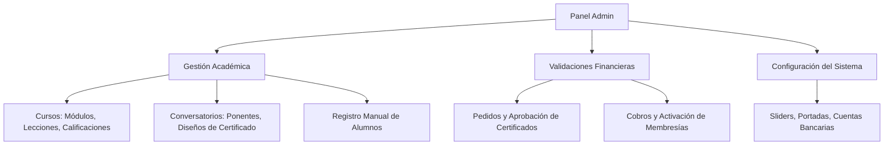
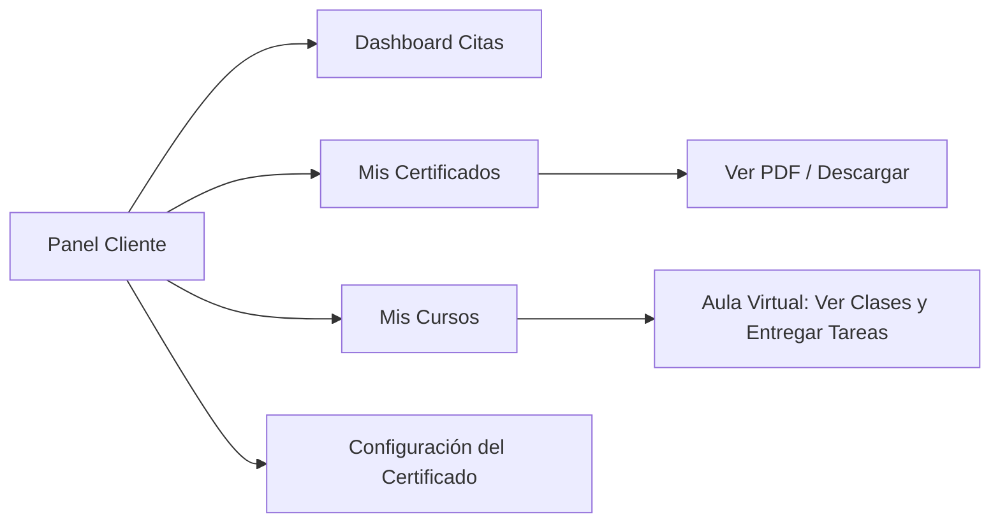

# Documentación General del Sistema - Profesionales Ecuador / LATAM

Este documento proporciona una guía detallada y estructurada de la arquitectura funcional de la plataforma. Detalla las vistas públicas, el funcionamiento de las entidades principales (Cursos y Conversatorios), los roles de usuario y las características de cada panel de control.

---

## 💻 1. Vistas Públicas y Navegación General

La interfaz pública está diseñada con una estética moderna, responsiva y orientada a la conversión, utilizando tipografías premium, transiciones suaves y micro-animaciones en componentes clave.

### 🏠 Inicio (Home)
- **Buscador Principal**: Barra de búsqueda predictiva para encontrar profesionales por nombre, especialidad o biografía.
- **Carrusel de Categorías**: Carrusel interactivo que muestra las profesiones activas en el sistema con contadores dinámicos de profesionales aprobados.
- **Profesionales Destacados**: Tarjetas premium que muestran a los profesionales que cuentan con suscripción activa y verificación, ordenados con prioridad.
- **Sliders Promocionales**: Banners dinámicos configurables por el administrador desde el panel de control.

### 🔍 Directorio y Búsqueda Profesional
- **Filtros Avanzados**: Búsqueda por texto libre, profesión, especialidad, provincia y ciudad.
- **Ordenamiento Inteligente**: Clasificación por precio (menor a mayor / mayor a menor) y orden predeterminado (profesionales verificados primero, seguidos por fecha de registro).
- **Paginación Dinámica**: Carga fluida de profesionales en bloques de 6 por página.

### 👤 Perfil Público del Profesional
- **Identidad**: Foto, slogan, tarifa de consulta, ubicación geográfica detallada e insignias de verificación.
- **Biografía y Servicios**: Detalle de la trayectoria profesional y catálogo de servicios ofrecidos con precios.
- **Agendamiento de Citas**: Formulario interactivo donde los clientes pueden agendar una cita seleccionando el motivo, fecha y hora disponible.

### 📅 Conversatorios (Eventos en Vivo)
- **Directorio de Eventos**: Listado público de conversatorios académicos y eventos en vivo. Muestra la fecha de transmisión, cupo y precio de acreditación.
- **Detalle de Conversatorio**:
  - **Cronograma**: Itinerario detallado del evento dividido por días y horas.
  - **Expositores**: Galería con perfiles de los ponentes.
  - **Acceso a Ponencias**: Reproductor de video integrado para ver las ponencias (acceso bloqueado mediante autenticación y compra de certificado).
  - **Flujo de Registro y Pago Unificado (Checkout Modal)**:
    - *Paso 1 (Autenticación)*: Modal interactivo para iniciar sesión o registrarse como cliente en el momento.
    - *Paso 2 (Configuración de Nombre)*: Entrada de texto pre-rellenada con el nombre del usuario para definir cómo aparecerá en el certificado digital.
    - *Paso 3 (Método de Pago)*: Selección de pasarela (Transferencia bancaria, PayPhone, Kushki o Gratis si el evento está configurado así).

### 🎓 Cursos Académicos
- **Catálogo de Cursos**: Muestra cursos activos con cálculo automático de descuentos vigentes.
- **Detalle del Curso**: Presenta los objetivos del curso, docentes enlazados y el **Temario Curricular** en acordeones interactivos que listan unidades, lecciones y tareas.

### 🛡️ Validador de Certificados (Modal Global)
- **Acceso Flotante**: Botón flotante persistente en la esquina inferior derecha. Al hacer clic, abre un modal premium.
- **Validación en Línea**: Permite ingresar el código único del certificado (ej: `CERT-XXXXXX-X`) o escanear el código QR impreso. Consulta la base de datos y retorna en tiempo real un certificado válido con el nombre del estudiante, el nombre del evento, la carga horaria y la fecha de acreditación.

---

## 👥 2. Roles de Usuario y Permisos

El sistema se gobierna bajo tres roles de usuario con permisos claramente delimitados en base a su naturaleza funcional.

| Rol | Descripción | Tipo de Acceso |
| :--- | :--- | :--- |
| **`ADMIN`** | Administrador del sistema. Control total de la plataforma. | Acceso absoluto a configuraciones, CRUDs y validaciones. |
| **`PROFESSIONAL`** | Profesional afiliado (médicos, abogados, consultores, etc.). | Panel de perfil profesional, agenda y facturación electrónica. |
| **`CLIENT`** | Cliente estándar / Alumno de cursos y conversatorios. | Panel de alumno, descargas de certificados y aula virtual. |

---

## 🔑 3. Características Detalladas por Rol

### 🔴 A. Panel del Administrador (`ADMIN`)
El panel administrativo permite gestionar los recursos del sistema, aprobar solicitudes financieras y académicas y analizar estadísticas en tiempo real.

#### 1. Gestión de Conversatorios
- **Creación y Edición**: Formulario de multimedia premium, switches para gratuidad del evento, aforo, ubicación física y archivos complementarios.
- **Itinerario Dinámico**: Permite crear días cronológicos y asignar expositores/docentes a cada bloque horario.
- **Diseño de Certificado en Línea**: Constructor interactivo dentro del evento para subir firmas de avales, configurar logos de instituciones, definir el número de horas académicas y plantilla del fondo del certificado.

#### 2. Gestión de Cursos Académicos
- **Constructor de Temarios (Curriculum Builder)**: Panel interactivo dentro de cada curso para crear unidades (módulos), lecciones en video (YouTube) y cargar materiales descargables (PDFs, guías).
- **Gestión de Tareas**: Permite asignar tareas dentro de lecciones específicas, detallando instrucciones, puntaje máximo (puntos) y adjuntos de apoyo.
- **Calificaciones ("Entregas")**: Tabla de entregas recibidas de estudiantes. El administrador puede revisar los documentos cargados, calificar de 0 a 100, cambiar el estado (Aprobada / Rechazada) y proveer una retroalimentación escrita (feedback).

#### 3. Registro Manual de Alumnos
- **Acción en Línea**: Botón de **"Inscribir"** en la fila de cada curso o conversatorio del listado.
- **Flujo de Matriculación**:
  - Solicita el correo del alumno. El sistema identifica automáticamente si el usuario ya existe o si es nuevo.
  - **Usuario Existente**: Se le matricula en el evento directamente y se le envía una notificación por correo electrónico.
  - **Usuario Nuevo**: El sistema crea la cuenta con rol `CLIENT`, genera una contraseña temporal (`TEMP-XXXXXX`), activa la bandera de configuración obligatoria (`requireProfileSetup = true`) y envía un correo con sus credenciales.
  - **Auto-Aprobación**: Genera una inscripción activa y un certificado aprobado con costo $0.00 para darle acceso inmediato al contenido.
  - **Copiar Credenciales**: El modal revela las credenciales y permite copiarlas formateadas para WhatsApp con un solo clic.

#### 4. Estadísticas y Analíticas en Tiempo Real
- Modal consolidado con tres pestañas analíticas:
  1. **Alumnos Registrados**: Tabla con nombres, correos y estado del certificado de todos los inscritos al evento.
  2. **Accesos de Video**: Gráficos de barras que rastrean las reproducciones y espectadores únicos de cada ponencia o lección.
  3. **Participación de Tareas**: Resumen estadístico de las entregas de tareas del curso (aprobadas, pendientes, rechazadas).

#### 5. Gestión de Pedidos y Cobros
- **Pedidos**: Revisión de transferencias bancarias de certificados. Al aprobar la transferencia, se activa y aprueba automáticamente el certificado del alumno.
- **Cobros / Cuentas**: Gestión de recargas de saldo de profesionales y pagos de membresías SaaS.

---

### 🔵 B. Panel del Profesional (`PROFESSIONAL`)
Orientado a los profesionales independientes que ofrecen sus servicios y facturan en la plataforma.

#### 1. Perfil Profesional
- Formulario de biografía, slogan, especialidades médicas/técnicas, catálogo de servicios, tarifas de consulta y galería multimedia.
- Configuración de horarios semanales hábiles para recibir citas automatizadas.

#### 2. Agenda de Citas
- Calendario y lista cronológica de citas solicitadas por clientes.
- Control de estados: Confirmar, Reprogramar (cambiar fecha/hora con alerta) o Cancelar.

#### 3. Facturación Electrónica (SRI Ecuador)
- **Configuración Emisor**: Ingreso de RUC, Razón Social, Dirección, Establecimiento, Punto de Emisión y firma electrónica (`archivo .p12` codificado con contraseña).
- **Generación de Facturas**: Formulario comercial para emitir facturas enlazadas a clientes. El sistema:
  1. Genera el archivo XML regulado por el SRI.
  2. Firma digitalmente el archivo XML usando la firma `.p12`.
  3. Transmite y autoriza en tiempo real ante el SRI en ambiente de Pruebas o Producción.
  4. Genera la representación impresa oficial (RIDE en formato PDF).
  5. Envía la Factura y el XML de forma automática por correo electrónico al cliente.

---

### 🟢 C. Panel del Cliente / Alumno (`CLIENT`)
Entorno enfocado en el aprendizaje y la gestión personal del usuario final.

#### 1. Dashboard de Citas
- Listado de citas agendadas con profesionales, mostrando la especialidad, fecha, hora y el estado de confirmación.

#### 2. Mis Certificados (Historial y Descargas)
- Historial interactivo de certificaciones adquiridas en conversatorios y cursos.
- Muestra el estado (Aprobado, En Validación, Rechazado).
- Botón para abrir y descargar la representación oficial en PDF del certificado.

#### 3. Mis Cursos y Aula Virtual
- Listado de cursos activos e inscritos.
- **Aula Virtual**:
  - Reproductor de video de clases en la parte central.
  - Barra lateral derecha para navegar interactivamente entre módulos y lecciones.
  - Descarga de material de apoyo en un clic.
  - **Panel de Tareas**: Muestra las actividades asignadas para la clase actual. Permite subir archivos (formatos PDF, imágenes, etc.) en Base64 directamente desde la interfaz. Muestra en tiempo real la calificación obtenida y la retroalimentación enviada por el docente.

#### 4. Configuración del Nombre del Certificado
- **Lógica de Bloqueo Temporal (60 Días)**:
  - Formulario para guardar el nombre de certificado por defecto (incluyendo títulos como *Dr.*, *Ing.*, etc.).
  - Para asegurar la seriedad académica del validador de firmas, este nombre **solo puede ser cambiado una vez cada 60 días**.
  - Si el usuario intenta cambiarlo antes, el cliente y el servidor bloquean la petición y le informan visualmente cuántos días faltan para desbloquear el formulario.
  - **IMPORTANTE (Política de Emisión)**: Las actualizaciones del nombre en este panel aplican **exclusivamente para futuros certificados**. No alteran en absoluto los certificados emitidos previamente.

---

## 🔒 4. Flujos Críticos de Seguridad y Experiencia

### 🛡️ Flujo de Primer Acceso de Alumno (Wizard de Configuración)
Cuando el administrador inscribe manualmente a un alumno nuevo, se dispara el siguiente flujo obligatorio:
1. El alumno recibe un correo con su contraseña temporal.
2. Al iniciar sesión en `/login`, el servidor detecta que `requireProfileSetup` es `true` y lo redirige forzosamente a `/profile-setup`.
3. El middleware global intercepta cualquier intento de navegación externa, bloqueando el acceso al dashboard o el aula hasta que complete el formulario.
4. El alumno ingresa sus nombres completos, celular, ciudad, define su contraseña permanente y el nombre para el certificado.
5. Al guardar:
   - Se encripta la nueva contraseña en la base de datos.
   - La bandera `requireProfileSetup` se desactiva (`false`).
   - **Se actualizan todos sus certificados iniciales (que tenían el placeholder `"Nuevo Alumno"`) con el nombre real configurado.**
   - El sistema redirige al alumno directamente al aula del curso o evento en el cual fue inscrito originalmente, logrando un onboarding fluido y sin fricciones.

---

## 📈 5. Historial de Mejoras y Actualizaciones

Este apartado recopila de manera ordenada y cronológica las actualizaciones y mejoras de diseño, lógica y base de datos implementadas en la plataforma.

### 🆕 Versión Actual (Junio 2026)

#### 👥 1. Registro Manual de Alumnos y Onboarding Automatizado (Wizard)
- **Matriculación Directa**: Incorporación de botones individuales de registro manual ("Inscribir" / "Matricular Alumno") en las filas de las tablas de Cursos y Conversatorios en el panel de administrador.
- **Flujo de Usuario Nuevo**:
  - Generación automática de contraseñas temporales (`TEMP-XXXXXX`).
  - Creación de cuenta con rol `CLIENT` y bandera `requireProfileSetup = true`.
  - Envío automático de credenciales vía correo electrónico (SMTP con nodemailer).
  - Modal de confirmación en el panel administrativo con botón de copiar credenciales formateadas para compartir directamente en WhatsApp.
- **Asistente de Primer Acceso (`/profile-setup`)**: Interfaz premium de configuración de perfil obligatorio que fuerza al alumno a registrar nombres, celular, ciudad, contraseña permanente y nombre de certificado en su primer login. Al guardar, actualiza y limpia automáticamente el nombre `"Nuevo Alumno"` de todos sus certificados preexistentes.

#### 🎓 2. Aula Virtual Completa y Gestión de Tareas (Cursos)
- **Estructura del Aula**: Aula virtual premium (`curso-aula.ejs`) con reproductor de video de clases (YouTube), barra lateral de navegación para unidades/lecciones y descarga directa de material didáctico.
- **Ciclo de Tareas**: Panel interactivo donde el alumno visualiza tareas asignadas a la lección, sube entregas de documentos en Base64, y consulta su nota y feedback.
- **Calificación en Admin**: Bandeja de "Entregas" para administradores que permite revisar archivos cargados, asignar notas sobre el puntaje máximo, y escribir comentarios de retroalimentación.

#### 📊 3. Estadísticas y Analíticas en Tiempo Real
- **Métricas Consolidadas**: Modal de analíticas para administradores con visualización en tiempo real de ingresos acumulados, cantidad de matriculados, tracking de vistas y espectadores únicos por ponencia/clase (`EventAccessLog`), e indicadores de avance en tareas.

#### 🔒 4. Políticas de Seguridad Académica y Validador
- **Control de Cambio de Nombre**: Formulario de nombre para certificado con validación de bloqueo temporal de 60 días para evitar modificaciones arbitrarias de los datos de certificación.
- **No-Retroactividad**: La actualización posterior del nombre preferido solo aplica a futuros certificados, resguardando la integridad legal de las credenciales previamente autorizadas.
- **Validador Global**: Botón flotante persistente en la web pública que abre un modal premium para validar la autenticidad de un código único de certificado o escaneo QR.

#### 🎨 5. Rediseño del Panel de Administración e Integración de Diseños
- **Formularios Homologados**: Rediseño del formulario de Cursos para equipararlo con el de Conversatorios (itinerarios de docentes por día, multimedia premium y aforo).
- **Eliminación de la Sección Revista**: Depuración del campo y enlaces de revista interactiva en los listados y detalles del curso.
- **Deprecación de la Pestaña de Certificados**: Eliminación del menú lateral de certificados; el diseño de plantillas se realiza ahora directamente en línea desde la lista de Cursos y Conversatorios correspondientes.
- **Estabilización de Edición**: Refactorización del flujo de datos en el cliente para cargar estructuras de cursos y docentes usando variables globales de JavaScript (`window.cursosList`), solucionando bugs de escape de comillas simples y saltos de línea al editar.
- **Corrección de Anidación y Cierre de Contenedores en Admin**: Eliminación de dos etiquetas `
` excedentes al final de la pestaña de Cursos que causaban el cierre prematuro del contenedor `<main>`. Asimismo, se agregaron las etiquetas de cierre faltantes (`</table>

</section>`) en la sección de Artículos (`tab-articles`). Esto soluciona de forma definitiva el error que hacía que pestañas como Artículos, Convenios, Publicidad/Hero, CMS Legal, Planes de Afiliación, Pedidos y Cobros/Cuentas se renderizaran anidadas incorrectamente y se visualizaran en blanco o mezcladas en la interfaz.

