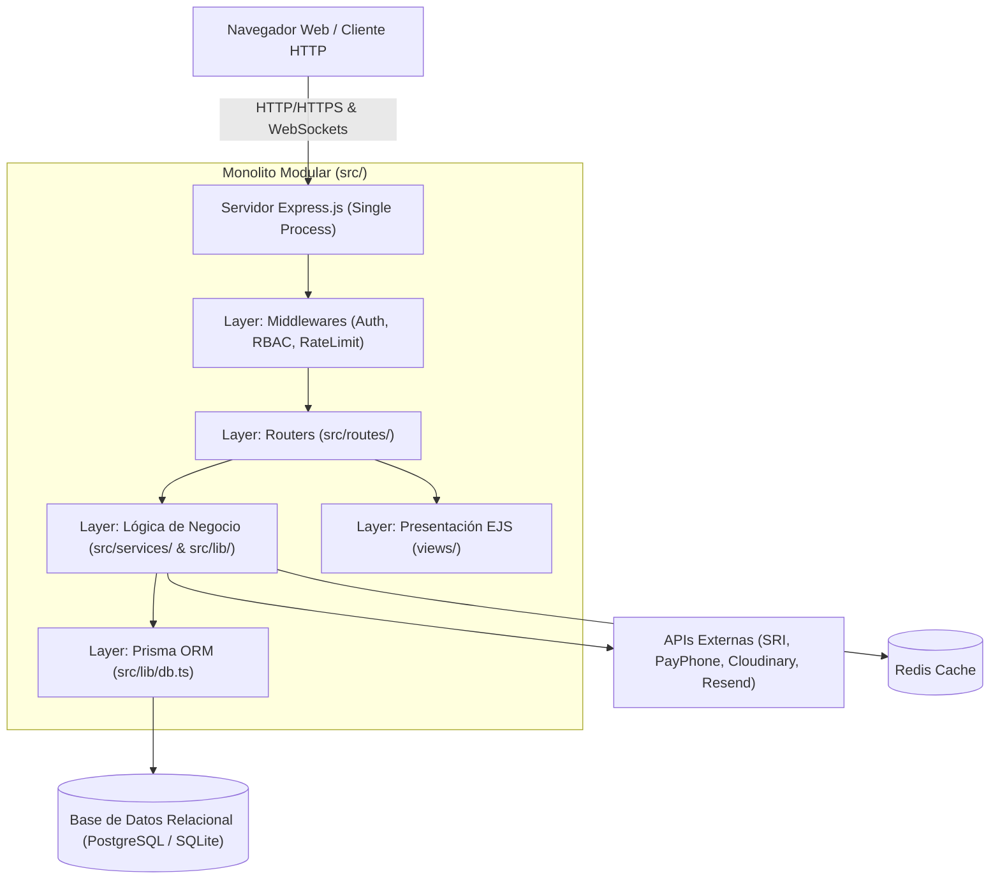

# 01 - Arquitectura General
**Proyecto:** Profesionales Ecuador V 2.0  
**Patrón de Arquitectura:** Monolito Modular (Modular Monolith)

---

## 1. Definición del Estilo Arquitectónico

**Profesionales Ecuador V 2.0** está construido estrictamente bajo una arquitectura de **Monolito Modular**. Todas las capacidades funcionales del sistema (gestión de usuarios, perfiles profesionales, directorio público, facturación electrónica SRI, eventos y conversatorios, cursos con ponencias, sistema de referidos con monedero virtual, integración de pagos PayPhone y notificaciones en tiempo real) se ejecutan dentro de una misma aplicación Express.js en TypeScript.

---

## 2. Capas Principales del Sistema

1. **Capa de Presentación (Presentation Layer):**
   * Motor de plantillas EJS renderizado del lado del servidor (SSR) en `views/`.
   * Estilos CSS con Tailwind CSS cargado dinámicamente mediante CDN.
   * Componentes dinámicos cliente construidos en JavaScript vanilla e íconos FontAwesome.

2. **Capa de Enrutamiento y Controladores (Routing & Handlers Layer):**
   * Módulos de rutas en `src/routes/` que reciben la petición HTTP, aplican middlewares de control de acceso y ejecutan la lógica de respuesta.

3. **Capa de Negocio y Servicios (Business & Domain Services Layer):**
   * Servicios en `src/services/` (`referral-sale.service.ts`, `referral-wallet.service.ts`, `commission.service.ts`, `certificate-eligibility.service.ts`) e integraciones en `src/lib/`.

4. **Capa de Persistencia y Acceso a Datos (Data Access Layer):**
   * Prisma ORM manejado desde `src/lib/db.ts` con acceso tipado a todas las tablas y transacciones `db.$transaction`.

5. **Capa de Integración Externa:**
   * **SRI Ecuador:** Firma electrónica de documentos XML (`.p12`) y envío de comprobantes electrónicos a los servicios web del SRI.
   * **PayPhone:** Procesamiento de cobros y transacciones con tarjetas de crédito/débito.
   * **Cloudinary:** Almacenamiento y entrega de medios digitales (fotografías, logotipos, comprobantes).
   * **Resend:** Servicio de entrega de correos electrónicos transaccionales y notificaciones de comisiones.

---

## 3. Modelo de Seguridad y Runtime

* **Runtime:** Node.js v20+ procesado mediante `tsx` en desarrollo y transpilado con `tsc` a JavaScript en producción (`dist/`).
* **Seguridad de Encabezados:** Helmet.js configurado con CSP flexible para permitir scripts en línea EJS.
* **Tolerancia a Fallos y Cache:** Redis para aceleración de lecturas frecuentes (`cachedFetch`) con fallback transparente a base de datos.
