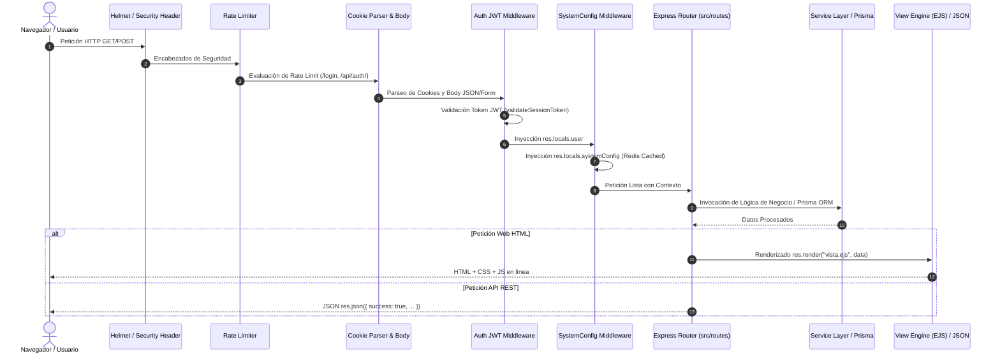

# 02 - Flujo General de Ejecución
**Proyecto:** Profesionales Ecuador V 2.0  
**Ámbito:** Ciclo de vida de peticiones HTTP, pipeline de middlewares y flujo cliente-servidor.

---

## 1. Ciclo de Vida de una Petición HTTP

Toda petición realizada al sistema pasa por una secuencia predefinida de procesamiento antes de emitir una respuesta.

---

## 2. Descripción Etapa por Etapa

### Etapa 1: Inserción de Encabezados de Seguridad (Helmet)
Express ejecuta `helmet({ contentSecurityPolicy: false })` para proteger contra ataques XSS, Clickjacking y MIME-sniffing, permitiendo la ejecución de scripts cliente necesarios en las plantillas EJS.

### Etapa 2: Control de Peticiones y Furia (Rate Limiting)
Rutas sensibles (`/login`, `/api/auth/`) pasan por `express-rate-limit`, restringiendo peticiones continuas (máximo 100 peticiones por ventana de 15 minutos por IP).

### Etapa 3: Autenticación y Contexto de Usuario (`src/server.ts`)
1. Se extrae el token JWT desde la cookie `token`.
2. Se ejecuta `validateSessionToken(token)` consultando las sesiones activas en la tabla `UserSession`.
3. Si la sesión es válida, se inyecta el objeto usuario en `req.user` y `res.locals.user`.
4. Si el usuario requiere configurar su perfil (`user.requireProfileSetup`), la petición es redirigida a `/profile-setup`.

### Etapa 4: Carga Global de Configuración del Sistema
El middleware inyecta `res.locals.systemConfig` consultando la base de datos a través de `cachedFetch(cacheKey.systemConfig.singleton(), ...)`, optimizando el rendimiento mediante caché en Redis.

### Etapa 5: Enrutamiento y Lógica
El enrutador (`public.routes.ts`, `admin.routes.ts`, `professional.routes.ts`, etc.) ejecuta las validaciones específicas, invoca a Prisma o a la capa de servicios (`src/services/`), y responde con la plantilla EJS compilada o una carga utilitaria JSON.
