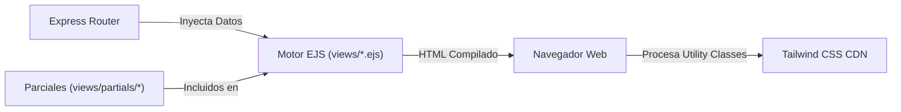

# 05 - Arquitectura del Frontend
**Proyecto:** Profesionales Ecuador V 2.0  
**Tecnología Principal:** EJS (Server-Side Rendering), Tailwind CSS CDN, JavaScript Vanilla Client-Side

---

## 1. Patrón de Renderizado en el Servidor (SSR)

El frontend de la aplicación utiliza el motor de plantillas **EJS (Embedded JavaScript)**. El HTML se compila directamente en el servidor Express e inyecta dinámicamente el estado del usuario (`res.locals.user`), configuraciones globales (`res.locals.systemConfig`) y colecciones de datos devueltas por Prisma ORM.

---

## 2. Sistema de Diseño y Estilos (Tailwind CSS)

* **Carga de Tailwind CSS:** Se incluye de forma dinámica mediante CDN en `views/partials/head.ejs` (``).
* **Configuración de Tema Dinámico:** Las paletas de colores corporativos (`primaryColor`, `secondaryColor`) y las tipografía de cuerpo/encabezados (`Outfit`, `Inter`) se leen desde `systemConfig` e inyectan directamente en `tailwind.config`.
* **Modo Oscuro:** Soporte para Dark Mode mediante la clase `.dark` agregada al elemento `<html>`, con persistencia en `localStorage.getItem('theme')`.

---

## 3. Parciales Reutilizables Principales (`views/partials/`)

* **`head.ejs`**: Inclusión de fuentes de Google Fonts, FontAwesome 6, Tailwind CDN, scripts de reproductor de video personalizado y configuración de Dark Mode.
* **`header.ejs`**: Barra de navegación superior con estado de autenticación, notificaciones emergentes, buscador con autocompletado y menú desplegable según el rol del usuario.
* **`footer.ejs`**: Pie de página institucional con logotipos, enlaces rápidos, redes sociales e información legal.
* **`custom-video-player.ejs`**: Reproductor de video personalizado con control de tiempo mínimo de permanencia para habilitación de certificados de ponencias.
* **`agreement-carousel.ejs`**: Carrusel interactivo de convenios institucionales responsivo.
