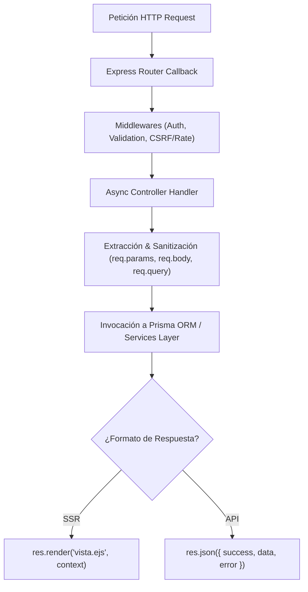

# 07 - Enrutadores y Controladores (Handlers)
**Proyecto:** Profesionales Ecuador V 2.0  
**Arquitectura de Handlers:** Funciones asíncronas en línea dentro de los módulos de enrutamiento Express.

---

## 1. Diseño de los Handlers en el Monolito

En el proyecto **Profesionales Ecuador V 2.0**, los controladores están integrados directamente como callbacks asíncronos (`async (req: Request, res: Response, next: NextFunction) => { ... }`) dentro de los archivos de rutas de cada dominio (`src/routes/*.ts`).

---

## 2. Desglose de Controladores por Módulo

### 2.1 Enrutador Público (`src/routes/public.routes.ts`)
* **`GET /` (Home Handler):** Invocación concurrente vía `Promise.all` para consultar profesiones en caché (`getAllProfessions`), convenios activos (`db.agreement.findMany`) y profesionales destacados. Renderiza `index.ejs`.
* **`GET /conversatorios/:idOrSlug` (Conversatorio Detail Handler):** Evalúa mediante expresiones regulares estricta (`/^\d+$/`) si el parámetro es un ID numérico o un Slug amigable. Si es ID numérico y posee slug, emite una redirección canónica 301. Carga ponentes, diseño de certificado y estado de suscripción/pago del usuario.
* **`POST /conversatorios/:id/completar-ponencia`:** Registra la asistencia del usuario a una ponencia, valida que se cumpla el tiempo mínimo de visualización configurado (`systemConfig.tiempoMinimoPonenciaMinutos`), actualiza el porcentaje de asistencia en `EventEnrollment` e invoca `CertificateEligibilityService` para determinar si el certificado fue desbloqueado.

### 2.2 Enrutador de Administración (`src/routes/admin.routes.ts`)
* **`GET /admin` (Dashboard Handler):** Consulta estadísticas globales del sistema (total de usuarios, profesionales activos, ingresos, facturas emitidas SRI, saldo de comisión de referidos y solicitudes de pago pendientes).
* **`POST /admin/payment-requests/:id/approve`:** Ejecuta una transacción Prisma (`db.$transaction`) para cambiar el estado de la solicitud a `APROBADO`, abonar el saldo o membresía al profesional o emitir el certificado del evento.

### 2.3 Enrutador de Referidos (`src/routes/referral.routes.ts`)
* **`GET /referral/wallet` (Wallet Handler):** Invoca a `ReferralWalletService` para calcular el saldo disponible, comisiones pendientes y comisiones cobradas del usuario afiliado.
* **`POST /referral/withdraw`:** Procesa una solicitud de retiro de fondos comprobando que el usuario tenga un saldo suficiente y una cuenta bancaria registrada.
