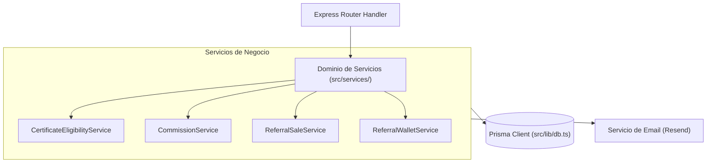

# 08 - Servicios de Lógica de Negocio (Domain Services)
**Proyecto:** Profesionales Ecuador V 2.0  
**Ubicación:** `src/services/` y `src/lib/`

---

## 1. Arquitectura de Servicios

La capa de servicios aísla la lógica de negocio compleja de la capa de enrutamiento HTTP, asegurando que las reglas de comisiones, billetera de referidos, emisión de certificados y facturación sean reutilizables y comprobables.

---

## 2. Detalle de los Servicios Principales

### 2.1 `CertificateEligibilityService` (`src/services/certificate-eligibility.service.ts`)
* **Responsabilidad:** Determina si un estudiante/usuario cumple con las condiciones para recibir un certificado de asistencia a un conversatorio o curso.
* **Caso de Uso:**
  1. Consulta las ponencias completadas por el usuario en `EventAccessLog` o `EventEnrollment`.
  2. Calcula el porcentaje de asistencia real vs el `porcentajeMinimoCertificado` configurado en el conversatorio.
  3. Evalúa si el conversatorio requiere pago o es gratuito (`conversatorio.gratuito` o pago aprobado en `PaymentRequest`/`PayPhoneTransaction`).
  4. Retorna `{ isEligible: boolean, progressPct: number, reason: string }`.

### 2.2 `CommissionService` (`src/services/commission.service.ts`)
* **Responsabilidad:** Calcula e imputa comisiones ganadas por promotores/afiliados al realizarse una venta referida.
* **Lógica Interna:** Aplica el porcentaje de comisión configurado en el perfil del referido o la comisión global por defecto sobre el monto neto de la venta (descontando impuestos si aplica).

### 2.3 `ReferralSaleService` (`src/services/referral-sale.service.ts`)
* **Responsabilidad:** Registra y traza las ventas atribuidas a un código de referido único (`referralCode`).
* **Lógica Interna:** Asocia la transacción comercial al promotor, crea el registro de venta `ReferralSale`, y programa el abono a la billetera en estado `PENDIENTE` o `DISPONIBLE`.

### 2.4 `ReferralWalletService` (`src/services/referral-wallet.service.ts`)
* **Responsabilidad:** Administra los saldos y movimientos del monedero digital del promotor (`ReferralWallet`).
* **Operaciones Principales:**
  * `getWalletBalance(referralProfileId)`: Retorna saldo disponible, saldo pendiente y total histórico cobrado.
  * `requestWithdrawal(...)`: Registra una solicitud de retiro de comisiones verificando que el saldo disponible sea suficiente.
