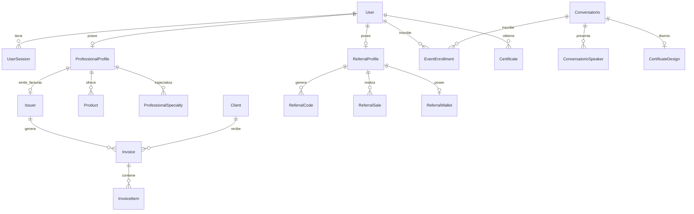

# 09 - Modelos de Datos (Prisma Schemas)
**Proyecto:** Profesionales Ecuador V 2.0  
**Ubicación del Esquema:** `prisma/schema.prisma`

---

## 1. Visión General del Modelo Entidad-Relación

El sistema cuenta con un esquema relacional integral compuesto por **32 modelos de datos** clasificados en 5 grandes dominios funcionales:

---

## 2. Catálogo de Modelos por Dominio

### 2.1 Dominio de Usuarios, Sesiones y Seguridad
* **`User`**: Almacena usuarios del sistema (Administradores, Profesionales, Clientes, Referidos/Promotores). Incluye campos como `email`, `password` (bcrypt), `name`, `status`, `roleId` y configuraciones de setup.
* **`Role`**: Define roles de usuario (`ADMIN`, `PROFESSIONAL`, `CLIENT`, `REFERRAL`).
* **`UserSession`**: Registra sesiones JWT activas con token ID, dirección IP, User-Agent, fecha de expiración y estado de revocación.

### 2.2 Dominio de Perfiles Profesionales y Directorio
* **`ProfessionalProfile`**: Perfil SaaS del profesional con biografía, slogan, tarifa, imágenes (foto/banner), ubicación (provincia, ciudad, dirección, latitud/longitud), tipo de plantilla (`EJECUTIVA`, `MEDICA`, `ESTANDAR`), estado de verificación y vigencia de suscripción.
* **`Profession`**: Catálogo de profesiones (ej. Derecho, Medicina, Ingeniería).
* **`Specialty`**: Catálogo de especialidades asociadas a una profesión.
* **`ProfessionalSpecialty`**: Tabla de unión N:M entre `ProfessionalProfile` y `Specialty`.

### 2.3 Dominio de Facturación Electrónica SRI y Comercio
* **`Issuer`**: Emisor de facturación electrónica autorizado por el SRI (RUC, firma `.p12`, ambiente 1=Pruebas/2=Producción, establecimiento, punto de emisión, secuencial).
* **`Client`**: Registro de clientes receptores de comprobantes (cédula, RUC, pasaporte, consumidor final).
* **`Product`**: Catálogo de productos/servicios ofertados por un emisor con tarifa de IVA.
* **`Invoice`**: Factura electrónica creada (secuencial, clave de acceso SRI de 49 dígitos, XML sin firmar, XML autorizado, RIDE PDF).
* **`InvoiceItem`**: Detalle de ítems contenidos en una factura.

### 2.4 Dominio de Cursos, Conversatorios y Certificados
* **`Conversatorio`**: Evento o curso (título, descripción, fecha, modalidad presencial/online, precio, gratuito, `porcentajeMinimoCertificado`, slug).
* **`ConversatorioSpeaker`**: Ponente asociado a un evento (nombre, tema, foto, URL de video de ponencia).
* **`EventEnrollment`**: Inscripción de un usuario a un conversatorio con porcentaje de asistencia completado.
* **`CertificateDesign`**: Plantilla de diseño gráfico del certificado (firma, sello, fondo, textos).
* **`Certificate`**: Certificado generado y otorgado a un usuario con código único de verificación.

### 2.5 Dominio de Afiliados, Referidos y Billetera Digital
* **`ReferralProfile`**: Perfil de promotor o afiliado con su código único de referido.
* **`ReferralSale`**: Registro de transacciones generadas por enlaces de referidos.
* **`ReferralWallet`**: Billetera digital del afiliado con acumulado de saldo disponible, saldo pendiente y retiros ejecutados.
* **`ReferralWithdrawal`**: Solicitud de transferencia bancaria para retiro de comisiones de afiliados.
