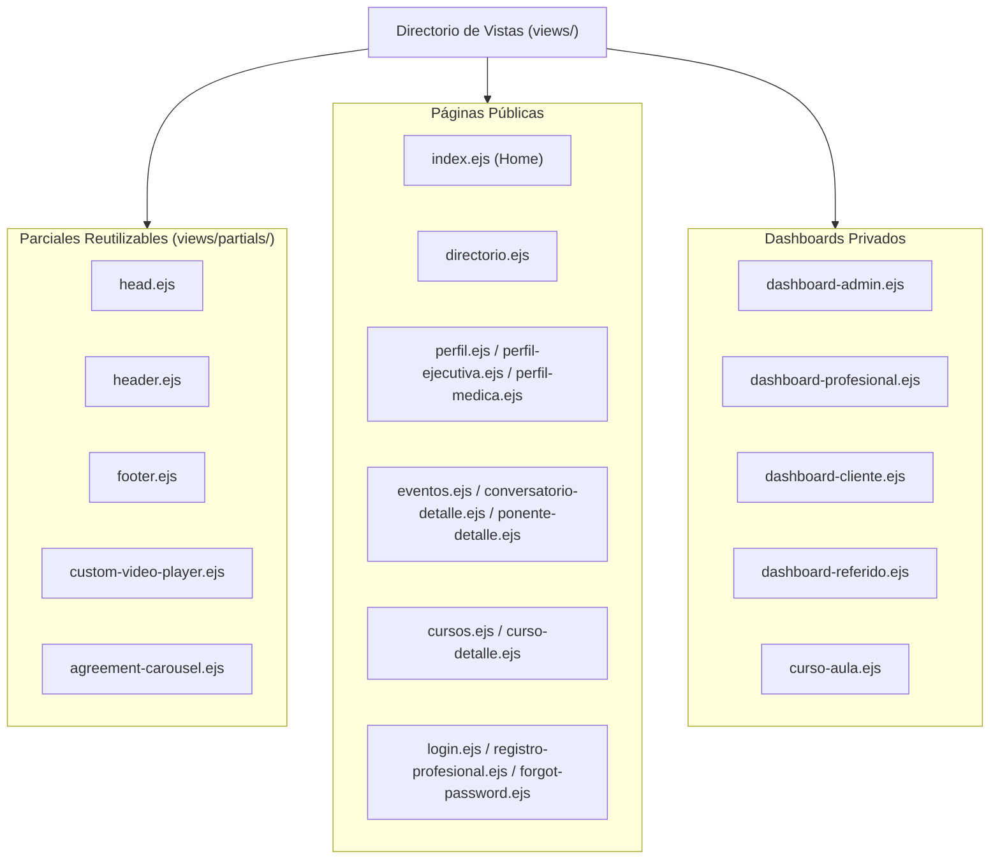

# 10 - Componentes de Vista y Plantillas EJS
**Proyecto:** Profesionales Ecuador V 2.0  
**Ubicación:** `views/` y `views/partials/`

---

## 1. Organización de Vistas en el Frontend

La capa de presentación consta de **37 vistas EJS** divididas entre páginas públicas de la plataforma, paneles privados (dashboards) por rol, y parciales reutilizables.

---

## 2. Catálogo de Vistas por Dominio

### 2.1 Plantillas de Perfil Profesional
* **`perfil.ejs`**: Plantilla Estándar de perfil profesional. Incluye portada, avatar flotante, biografía, especialidades, productos/servicios ofertados, mapa de ubicación Leaflet y formulario de agendamiento de citas.
* **`perfil-ejecutiva.ejs`**: Plantilla Ejecutiva estilizada. Diseñada para abogados, consultores y ejecutivos con portada a ancho completo, avatar circular prominente y paleta azul corporativa.
* **`perfil-medica.ejs`**: Plantilla Médica especializada. Diseñada para doctores y profesionales de la salud con sección limpia de "Nuestros Servicios Médicos" y horario de atención.

### 2.2 Páginas de Educación y Ponencias
* **`eventos.ejs`**: Catálogo de conversatorios y seminarios.
* **`conversatorio-detalle.ejs`**: Detalle del conversatorio con lista de ponentes, temario, valor del certificado de horas y estado de inscripción.
* **`ponente-detalle.ejs`**: Presentación del ponente, su tema de ponencia y reproductor de video (o pantalla de contenido exclusivo bloqueado con botón de adquisición de certificado).
* **`ponencia-video.ejs`**: Transmisión/grabación de la ponencia con medidor de tiempo de permanencia y control de progreso de asistencia.
* **`certificado.ejs`**: Vista de visualización y descarga del certificado en formato PDF/impresión.

### 2.3 Dashboards y Paneles Administrativos
* **`dashboard-admin.ejs`**: Panel de control maestro para administradores (gestión de usuarios, solicitudes de pago, facturas SRI, configuración global del sistema).
* **`dashboard-profesional.ejs`**: Panel del profesional (edición de perfil, carga de productos, visualización de citas agendadas, descarga de facturas).
* **`dashboard-referido.ejs`** / **`referido-billetera.ejs`**: Panel del promotor/afiliado con su enlace único de referido, balance de billetera y formulario de retiro de comisiones.
