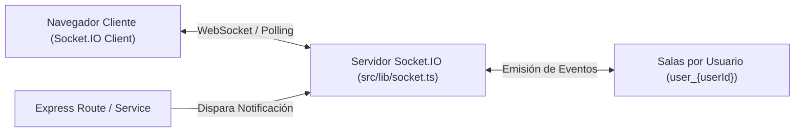

# 11 - Hooks y Comunicación en Tiempo Real
**Proyecto:** Profesionales Ecuador V 2.0  
**Ubicación:** `src/lib/socket.ts`

---

## 1. Integración de WebSockets en el Monolito

El backend integra un servidor de comunicación bidireccional en tiempo real basado en **Socket.IO** v4 montado sobre el servidor HTTP nativo de Node.js en `src/server.ts`.

---

## 2. Eventos y Salón de Comunicación

* **`connection`:** Establecido cuando un cliente autenticado abre una conexión Socket.IO desde el navegador.
* **`join` / `join_room`:** Permite al cliente unirse a su sala privada de notificaciones (`user_${userId}`).
* **`notification`:** Evento emitido por los servicios del servidor (ej. aprobación de solicitud de pago, abono de comisión de referido, nuevo mensaje) enviando una carga útil `{ title, message, type, link }`.
* **`disconnect`:** Captura la desconexión del cliente limpiando los listeners activos.
