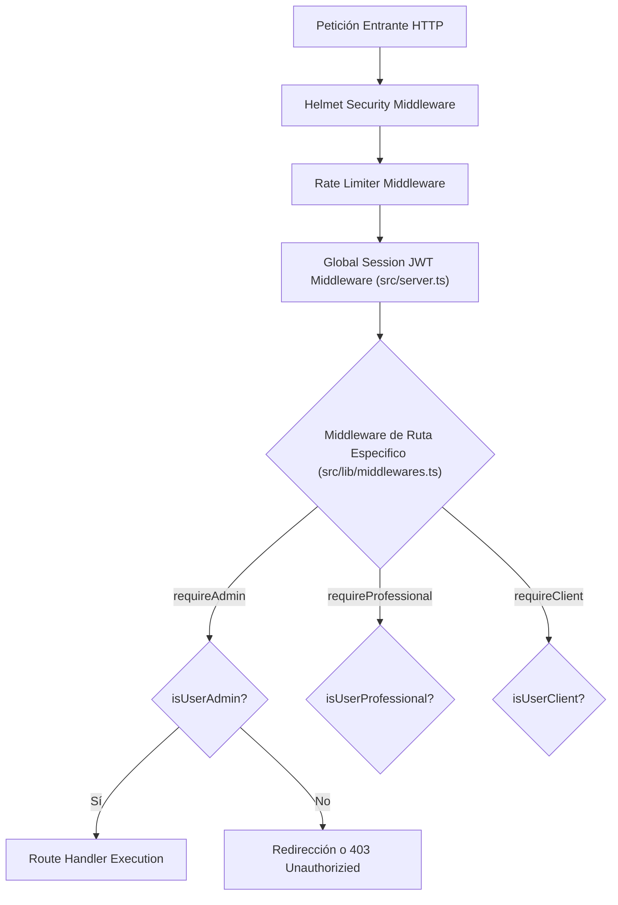

# 12 - Middlewares del Sistema
**Proyecto:** Profesionales Ecuador V 2.0  
**Ubicación:** `src/lib/middlewares.ts` y `src/server.ts`

---

## 1. Pipeline de Middlewares

Los middlewares filtran, autentican y autorizan cada petición entrante en el monolito.

---

## 2. Detalle de Middlewares

### 2.1 Middleware Global de Sesión JWT (`src/server.ts`)
Intercepta toda petición HTTP. Lee la cookie `token`, ejecuta `validateSessionToken(token)` en base de datos (`UserSession`) e inyecta `res.locals.user = user`. Si el usuario debe completar su registro inicial (`requireProfileSetup`), bloquea el acceso y redirige a `/profile-setup`.

### 2.2 `requireAdmin` (`src/lib/middlewares.ts`)
Verifica que `res.locals.user` exista y que su rol sea `ADMIN` (o `roleId` correspondiente al rol administrativo). Si no cumple, responde con 403 Forbidden o redirige al login.

### 2.3 `requireProfessional` (`src/lib/middlewares.ts`)
Verifica que el usuario autenticado posea el rol `PROFESSIONAL` y cuente con un perfil profesional activo (`ProfessionalProfile`).

### 2.4 `requireClient` (`src/lib/middlewares.ts`)
Garantiza que el usuario tenga el rol de cliente final (`CLIENT`) para agendar citas o adquirir certificados.

### 2.5 Rate Limiting Middleware (`src/server.ts`)
Protección contra fuerza bruta en `/login` y `/api/auth/` con un límite estricto de 100 peticiones cada 15 minutos por dirección IP.
