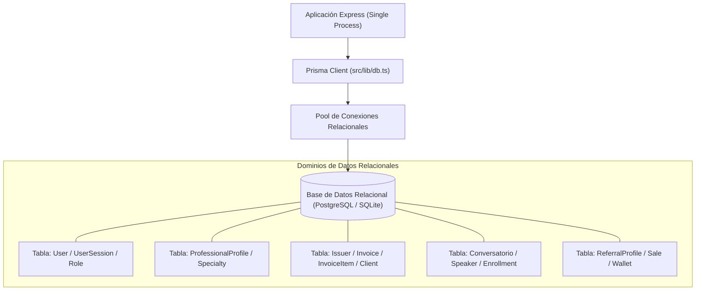

# 15 - Arquitectura de Base de Datos y Persistencia
**Proyecto:** Profesionales Ecuador V 2.0  
**Motor de Persistencia:** PostgreSQL (Producción) / SQLite (Desarrollo local)  
**ORM:** Prisma Client v6

---

## 1. Arquitectura de Datos Relacional

La base de datos relacional almacena el estado completo del sistema. Todos los módulos del monolito comparten una misma base de datos expuesta mediante el cliente singleton `src/lib/db.ts` (`export const db = new PrismaClient()`).



---

## 2. Estrategia de Migraciones e Índices

* **Migraciones Prisma:** Controladas secuencialmente en `prisma/migrations/`. La sincronización en producción se realiza mediante `npx prisma db push` o `npx prisma migrate deploy`.
* **Indexación de Alto Rendimiento:**
  * `UserSession`: Índices compuestos sobre `[userId, revokedAt, expiresAt, createdAt]` y `[tokenId, userId]` para acelerar la validación de tokens JWT en cada petición HTTP.
  * `PaymentRequest`: Índices sobre `[bankAccountId]`, `[estado, fechaSolicitud]` y `[staleAdminEmailSentAt, staleAdminEmailLastAttemptAt]`.
  * `Conversatorio`: Índice sobre `slug` e `id` para acelerar la resolución de páginas amigables SEO.
  * `ProfessionalProfile`: Índice único sobre `slug` y relaciones N:M optimizadas con `ProfessionalSpecialty`.

---

## 3. Manejo de Transacciones `db.$transaction`

Para garantizar la consistencia ACID en operaciones críticas (ej. aprobación de retiros en la billetera de referidos, emisión de facturas SRI con actualización de secuencial, aprobación de membresías), se ejecutan bloques transaccionales explícitos:

```typescript
// Ejemplo de transacción atómica en el monolito
await db.$transaction(async (tx) => {
  const request = await tx.paymentRequest.update({ ... });
  const wallet = await tx.referralWallet.update({ ... });
  await tx.referralWithdrawal.create({ ... });
});
```
