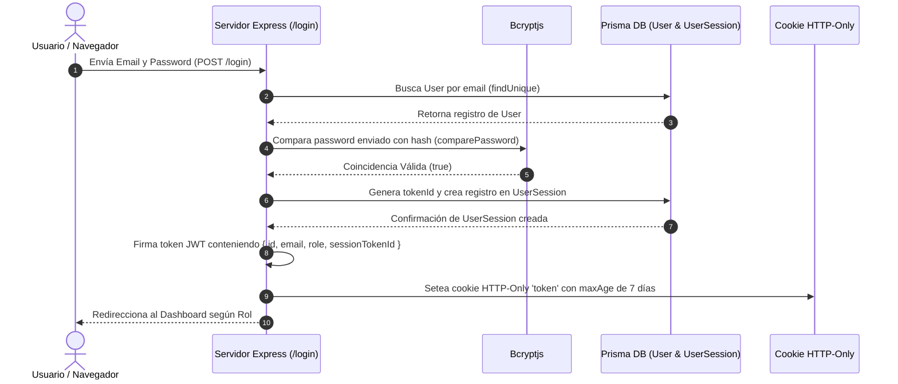

# 16 - Sistema de Autenticación y Sesiones
**Proyecto:** Profesionales Ecuador V 2.0  
**Mecanismo:** JWT (JSON Web Tokens) en Cookies HTTP-Only, Hash Bcrypt, Tabla `UserSession`

---

## 1. Flujo de Autenticación Completo

El proceso de autenticación combina la seguridad de criptografía por contraseña con hashing seguro Bcryptjs, emisión de tokens firmados dinámicamente y registro en base de datos.

---

## 2. Componentes de Autenticación (`src/lib/auth.ts`)

* **Hash de Contraseñas:** `hashPassword(password: string)` utiliza `bcrypt.hash` con costo de trabajo 10 (salt rounds).
* **Verificación de Contraseñas:** `comparePassword(plain, hashed)` valida la contraseña del usuario.
* **Creación de Sesiones:** `createAuthSession(userId, req)` genera un UUID único `tokenId`, calcula la fecha de expiración (7 días) y almacena `ipAddress` y `userAgent` en la tabla `UserSession`.
* **Validación de Sesiones en Middleware (`validateSessionToken`):**
  1. Verifica la firma del JWT con la clave secreta `JWT_SECRET`.
  2. Extrae `sessionTokenId` y busca el registro en `UserSession`.
  3. Verifica que la sesión no esté expirada (`expiresAt > now()`) ni revocada (`revokedAt === null`).
  4. Retorna el usuario activo con sus relaciones de rol y perfil.
* **Cierre de Sesión y Revocación (`revokeSessionFromToken`):**
  Marca `revokedAt = new Date()` en la tabla `UserSession` y limpia la cookie `token` en el cliente.
