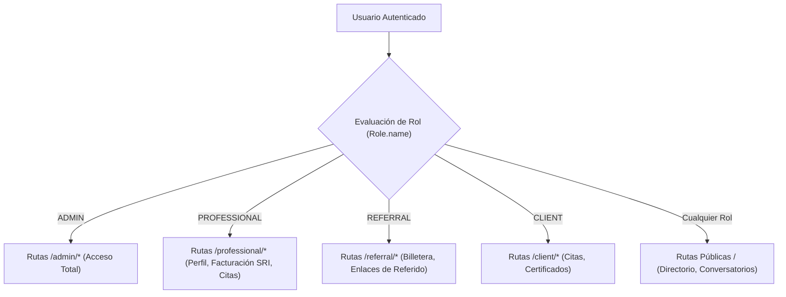

# 17 - Sistema de Permisos y Autorización (RBAC)
**Proyecto:** Profesionales Ecuador V 2.0  
**Patrón:** Control de Acceso Basado en Roles (Role-Based Access Control)

---

## 1. Matriz de Roles y Permisos

El sistema define 4 roles principales administrados mediante la relación entre `User` y `Role` en Prisma.

---

## 2. Permisos y Alcance por Rol

| Rol | Alcance de Permisos | Archivos / Rutas Protegidas |
| :--- | :--- | :--- |
| **`ADMIN`** | Acceso total al panel maestro. Puede aprobar solicitudes de pago, gestionar configuraciones del sistema, emitir facturas SRI, modificar usuarios, suspender cuentas y gestionar el programa de referidos. | `src/routes/admin.routes.ts`, `src/routes/admin-referral.routes.ts`, `views/dashboard-admin.ejs` |
| **`PROFESSIONAL`** | Edición de perfil profesional SaaS, configuración de plantilla (`EJECUTIVA`, `MEDICA`, `ESTANDAR`), carga de productos/servicios, visualización de citas agendadas y emisión de comprobantes electrónicos SRI. | `src/routes/professional.routes.ts`, `views/dashboard-profesional.ejs` |
| **`REFERRAL`** | Acceso al programa de afiliados. Generación de código único de referido, visualización de ventas atribuidas, balance de billetera y solicitudes de retiro de fondos. | `src/routes/referral.routes.ts`, `views/dashboard-referido.ejs`, `views/referido-billetera.ejs` |
| **`CLIENT`** | Agendamiento de citas profesionales, adquisición e inscripción a conversatorios/cursos, y descarga de certificados de asistencia. | `src/routes/client.routes.ts`, `views/dashboard-cliente.ejs` |
