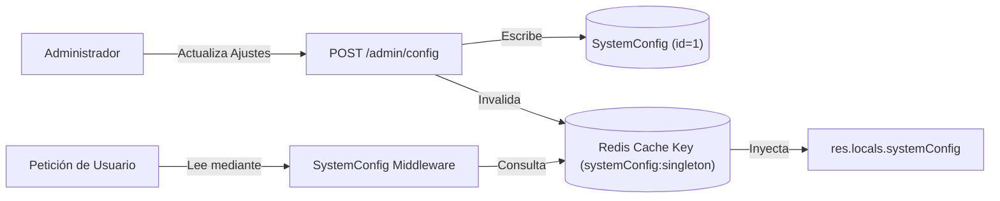

# 18 - Configuraciones del Sistema
**Proyecto:** Profesionales Ecuador V 2.0  
**Ubicación:** Tabla `SystemConfig` en Prisma y `src/server.ts`

---

## 1. Patrón de Configuración Dinámica Singleton

El monolito utiliza el modelo singleton `SystemConfig` (`id = 1`) almacenado en la base de datos relacional para permitir la personalización de la plataforma en tiempo de ejecución sin necesidad de reiniciar el servidor Node.js.

---

## 2. Parámetros Principales de Configuración

* **Identidad e Imagen Institucional:** `systemName`, `systemLogo` (Base64), `footerLogo`, `loginTitle`, `loginSubtitle`, `metaDescription`, `metaIcon`.
* **Personalización de Tema (Design System):** `primaryColor` (ej. `#0A3C84`), `secondaryColor` (ej. `#0a66c2`), `fontFamily` (ej. `Outfit`), `headingFontFamily`.
* **Integraciones y Credenciales:**
  * **PayPhone:** `payphoneToken`, `payphoneStoreId`.
  * **Facturación SRI:** `taxRate` (Porcentaje de IVA / Tax).
  * **Cloudinary:** `cloudinaryCloudName`, `cloudinaryApiKey`, `cloudinaryApiSecret`.
  * **Resend Email:** `resendApiKey`, `resendFromEmail`.
  * **IA Google Gemini:** `geminiApiKey`, `geminiProjectName`, `geminiProjectNumber`.
* **Educación y Conversatorios:** `tiempoMinimoPonenciaMinutos` (Tiempo mínimo de permanencia en video para acreditar asistencia, valor por defecto: 3 minutos).
* **Cuentas Bancarias Institucionales:** `bankAccounts` (Texto formateado o snapshots de cuentas de depósito/transferencia para adquisición de certificados y suscripciones).
