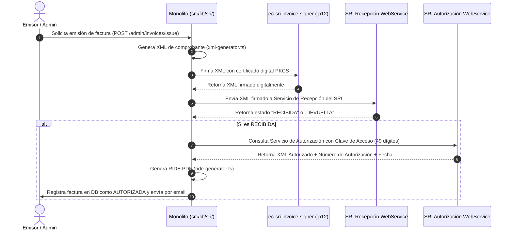

# 20 - Integraciones Externas y Servicios Web
**Proyecto:** Profesionales Ecuador V 2.0  
**Ámbito:** Servicios Web SRI Ecuador, Pasarela PayPhone, Cloudinary, Resend Mailer

---

## 1. Integración con el SRI (Servicio de Rentas Internas de Ecuador)

Ubicación: `src/lib/sri/`

El módulo de facturación electrónica permite la emisión legal de comprobantes en Ecuador.

---

## 2. Integración con Pasarela PayPhone

Ubicación: `src/lib/payphone.ts` y `src/routes/payphone.routes.ts`

* **`preparePayPhonePayment({ amount, clientTransactionId, ... })`**:
  Genera un pago en PayPhone enviando el monto en centavos, la moneda (`USD`), el ID de transacción generado por el monolito (`clientTransactionId`) y la clave de API. PayPhone devuelve una URL de checkout segura para el usuario.
* **`confirmPayPhonePayment({ paymentId, clientTransactionId })`**:
  Verifica el resultado de la transacción invocando la API de PayPhone. Si la respuesta indica estado `APPROVED` (`statusCode === 3`), activa automáticamente el producto, membresía o certificado adquirido.

---

## 3. Integración con Cloudinary y Resend

* **Cloudinary (`src/lib/cloudinary.ts`):** Almacenamiento seguro de imágenes Base64 enviadas desde los formularios de edición de perfil profesional y comprobantes de depósito.
* **Resend Mailer (`src/lib/email.ts`):** Envío de notificaciones por correo electrónico (facturas autorizadas en PDF/XML, avisos de comisiones de afiliados, y restablecimiento de contraseña).
