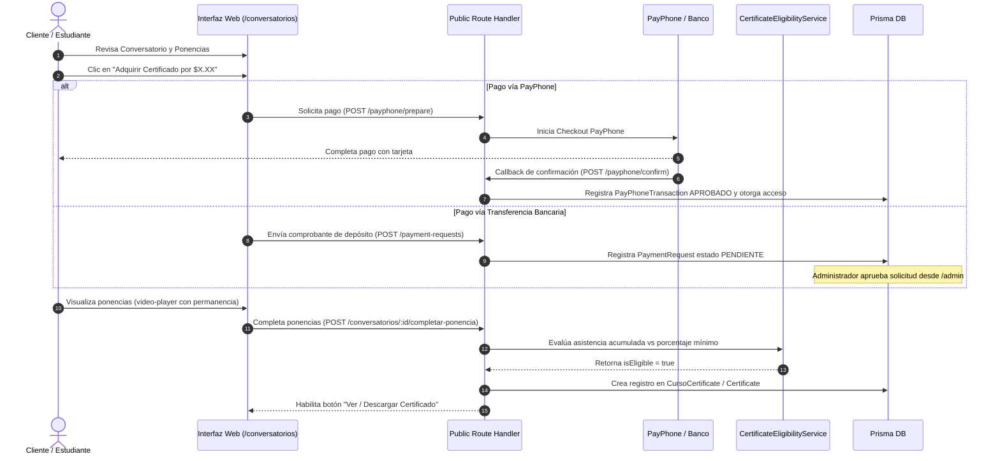
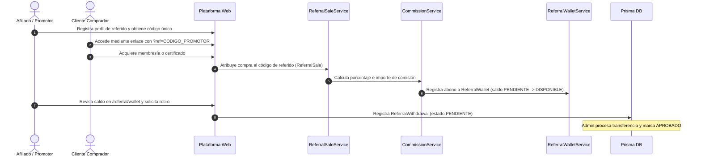

# 21 - Flujos Principales de Negocio (End-to-End)
**Proyecto:** Profesionales Ecuador V 2.0  
**Ámbito:** Recorridos funcionales completos de los casos de uso principales.

---

## 1. Flujo de Adquisición y Emisión de Certificado de Conversatorio

Este flujo describe cómo un participante adquiere y desbloquea su certificado de horas.

---

## 2. Flujo del Sistema de Afiliados, Referidos y Billetera Digital

