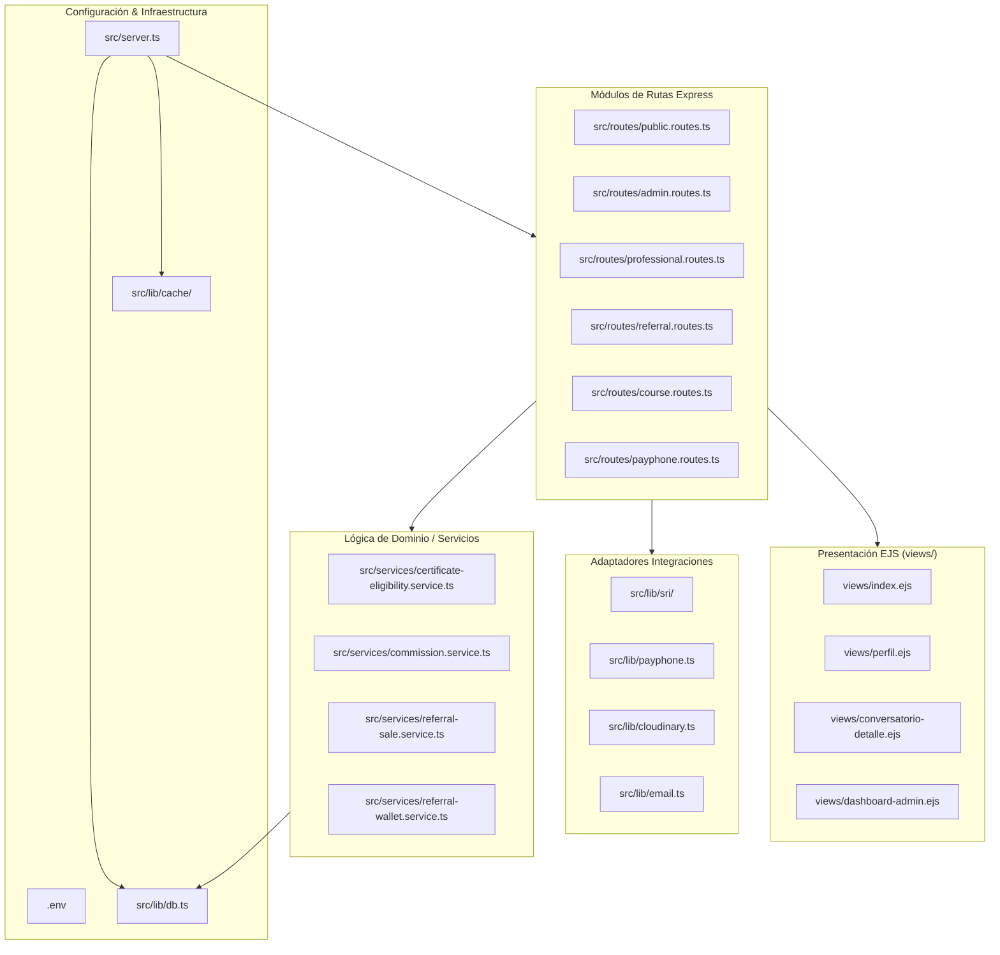

# 23 - Mapa Integral del Proyecto y Matriz de Relaciones
**Proyecto:** Profesionales Ecuador V 2.0  
**Ámbito:** Matriz de dependencias y mapa relacional entre archivos del monolito.

---

## 1. Mapa Relacional del Monolito Modular

---

## 2. Matriz Principales Archivos vs Módulos Consumidores

| Archivo Fuente | Rol / Responsabilidad | Módulos Consumidores |
| :--- | :--- | :--- |
| `src/lib/db.ts` | Conexión Singleton Prisma Client | Todos los enrutadores y servicios |
| `src/lib/auth.ts` | Autenticación JWT y Bcrypt | `server.ts`, `public.routes.ts`, `middlewares.ts` |
| `src/lib/middlewares.ts` | RBAC (requireAdmin, requireProfessional) | `admin.routes.ts`, `professional.routes.ts` |
| `src/services/referral-wallet.service.ts` | Billetera y saldos de promotores | `referral.routes.ts`, `admin-referral.routes.ts` |
| `src/lib/sri/xml-generator.ts` | Generador XML de comprobantes SRI | `admin.routes.ts`, `professional.routes.ts` |
| `src/lib/payphone.ts` | Integración API Pasarela PayPhone | `payphone.routes.ts`, `public.routes.ts` |
