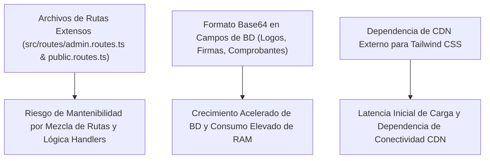

# 25 - Análisis Técnico, Diagnóstico y Recomendaciones
**Proyecto:** Profesionales Ecuador V 2.0  
**Ámbito:** Evaluación técnica del Monolito Modular, fortalezas, riesgos, deuda técnica y recomendaciones arquitectónicas.

---

## 1. Fortalezas de la Arquitectura Actual

1. **Simplicidad Operativa de Monolito Modular:** Al mantener todo el dominio de negocio en una sola unidad de código y despliegue, se elimina la complejidad de red, latencias inter-servicio y la necesidad de orquestación distribuida (Kubernetes, mTLS, Service Meshes).
2. **Abstracción Tipada con Prisma ORM:** Excelente integridad relacional y tipo de datos estricto a través de TypeScript y Prisma Client v6.
3. **Mapeo Robusto de Facturación Electrónica SRI:** Integración completa para el ecosistema tributario de Ecuador (firma `.p12`, transmisión SOAP/XML y generación RIDE PDF).
4. **Diseño Responsivo Moderno:** Uso eficiente de EJS + Tailwind CSS con renderizado veloz del lado del servidor (SSR).

---

## 2. Puntos de Riesgo y Deuda Técnica Identificada

### 2.1 Archivos Extensos con Múltiples Responsabilidades
* `src/routes/admin.routes.ts` (153 KB) y `src/routes/public.routes.ts` (114 KB) contienen tanto la definición de endpoints como la lógica detallada de los controladores en línea.
* *Recomendación Futura (Informativa):* Separar en el futuro los handlers en controladores dedicados (`src/controllers/admin.controller.ts`) manteniendo la estructura monolítica.

### 2.2 Almacenamiento de Imágenes y Medios en Cadenas Base64
* Varios modelos (`Issuer.logo`, `SystemConfig.systemLogo`, `PaymentRequest.comprobante`) permiten guardar imágenes codificadas en Base64 directamente en columnas de la base de datos relacional.
* *Recomendación Futura (Informativa):* Canalizar todas las subidas de archivos exclusivamente a Cloudinary y almacenar únicamente la URL string del recurso.

---

## 3. Conclusión del Análisis

El sistema **Profesionales Ecuador V 2.0** presenta una base monolítica modular sólida, bien estructurada en TypeScript y con un alto grado de funcionalidad para el mercado ecuatoriano. La presente suite documental (`/docs/`) sirve como la fuente oficial inmutable de contexto y referencia técnica para garantizar el mantenimiento y evolución continua del proyecto.
