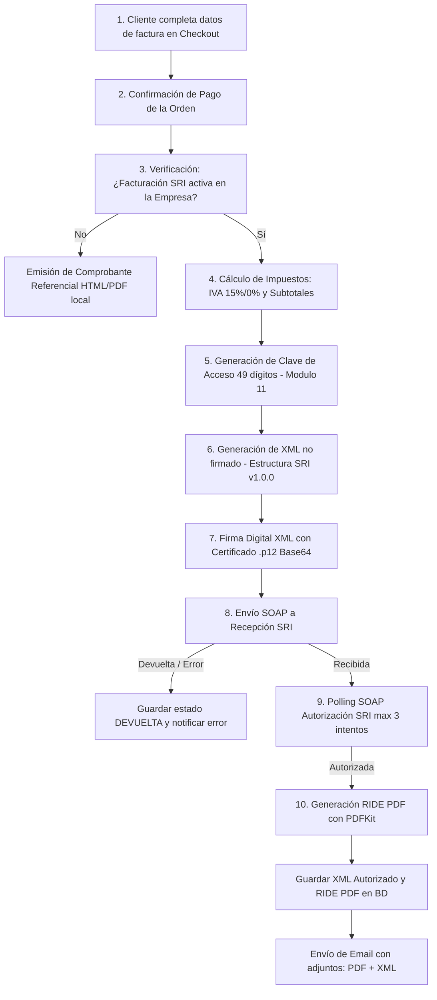

# Plan Maestro y Guía de Extracción: Proceso de Facturación Electrónica SRI (Ecuador)

Este documento contiene **absolutamente todo el proceso de facturación electrónica SRI (Ecuador)** implementado en este sistema. Su objetivo es permitir extraer, replicar e implementar este módulo en cualquier otro proyecto (Node.js / Express / TypeScript / Prisma / React) de forma rápida, directa y limpia.

---

## 1. Arquitectura General y Flujo de Trabajo

El flujo de facturación electrónica del SRI consta de 10 etapas secuenciales:



---

## 2. Dependencias Requeridas

Instalar los siguientes paquetes npm en el proyecto de destino:

```bash
npm install ec-sri-invoice-signer fast-xml-parser pdfkit @prisma/client nodemailer
npm install --save-dev @types/pdfkit @types/node typescript
```

### Descripción de Paquetes Clave:
* `ec-sri-invoice-signer`: Firma electrónica nativa de documentos XML usando archivos de certificado digital `.p12` de Ecuador (BCE, Security Data, ANF, UANATACA, etc.).
* `fast-xml-parser`: Parser súper rápido para procesar las respuestas XML SOAP recibidas del SRI.
* `pdfkit`: Generador de documentos PDF para construir el RIDE (Representación Impresa del Documento Electrónico).

---

## 3. Modelo de Datos (Prisma Schema)

Para soportar facturación del SRI y multi-inquilino/empresa, la base de datos debe almacenar tanto los datos del emisor (empresa) como los del comprobante/orden.

### 3.1. Campos en el Emisor / Empresa (`Page` o `Company`)

```prisma
model Page {
  id                        Int      @id @default(autoincrement())
  name                      String
  ruc                       String?
  direccion                 String?

  // Configuración SRI
  sri_active                Boolean  @default(false)
  sri_razon_social         String?
  sri_nombre_comercial     String?
  sri_direccion            String?
  sri_establecimiento      String   @default("001")
  sri_punto_emision        String   @default("001")
  sri_obligado_contabilidad Boolean  @default(false)
  sri_regimen              String   @default("REGIMEN RIMPE") // REGIMEN RIMPE, REGIMEN GENERAL, etc.
  sri_ambiente             Int      @default(1)              // 1 = Pruebas, 2 = Producción
  sri_firma                String?  @db.Text                 // Certificado .p12 codificado en Base64
  sri_password             String?                           // Contraseña de la firma .p12
  sri_secuencial           String   @default("000000001")    // Contador secuencial de 9 dígitos
}
```

### 3.2. Campos en la Orden / Factura (`Order`)

```prisma
model Order {
  idOrden                  Int      @id @default(autoincrement())
  monto_subtotal           Float
  monto_total              Float
  estado                   String   @default("PENDIENTE") // PENDIENTE, PAGADO, CANCELADO
  metodo_pago              String   // TRANSFERENCIA, PAYPHONE, PAYPAL, TARJETA

  // Datos básicos del comprador
  correo_comprador         String
  cedula_comprador         String
  telefono_comprador       String
  nombre_comprador         String
  provincia_comprador      String
  ciudad_comprador         String

  // Datos de Facturación opcionales (si difieren del comprador)
  factura_nombre           String?
  factura_apellidos        String?
  factura_cedula_ruc       String?
  factura_pais             String?
  factura_provincia        String?
  factura_ciudad           String?
  factura_telefono         String?
  factura_correo           String?

  // Datos devueltos por el SRI
  sri_clave_acceso         String?
  sri_secuencial           String?
  sri_estado               String?  // CREADA, RECIBIDA, AUTORIZADA, DEVUELTA, ERROR
  sri_xml                  String?  @db.LongText // XML firmado / autorizado final
  sri_pdf                  String?  @db.Text     // PDF RIDE en formato Base64
  sri_error                String?  @db.Text     // Detalle de errores devueltos por el SRI

  created_at               DateTime @default(now())
  updated_at               DateTime @updatedAt
}
```

---

## 4. Estructura de Archivos del Módulo de Facturación

Recomendamos organizar la estructura del código en el nuevo proyecto de la siguiente manera:

```text
src/
└── services/
    ├── SriBillingService.ts      # Orquestador principal (emitInvoice)
    ├── EmailSender.ts            # Envío de correos con adjuntos PDF + XML
    └── sri/
        ├── sri-utils.ts          # Algoritmo Módulo 11 y Clave de Acceso
        ├── xml-generator.ts      # Generador de XML Factura v1.0.0
        ├── sri-signer.ts         # Firma digital PKCS#12 (.p12)
        ├── sri-client.ts         # Cliente SOAP SRI (Recepción y Autorización)
        └── ride-generator.ts     # Generador de PDF RIDE visual (PDFKit)
```

---

## 5. Código Fuente Completo del Módulo

### 5.1. `sri-utils.ts` (Clave de Acceso y Módulo 11)

```typescript
/**
 * Calcula el dígito verificador usando el algoritmo Módulo 11
 * requerido por el SRI para claves de acceso de 48 dígitos.
 */
export function getMod11Dv(num: string): number {
  let sum = 0;
  let factor = 2;

  for (let i = num.length - 1; i >= 0; i--) {
    const digit = parseInt(num.charAt(i), 10);
    if (isNaN(digit)) continue;

    sum += digit * factor;
    factor = factor === 7 ? 2 : factor + 1;
  }

  const dv = 11 - (sum % 11);
  if (dv === 10) return 1;
  if (dv === 11) return 0;
  return dv;
}

/**
 * Genera la clave de acceso de 49 dígitos para comprobantes electrónicos
 * Formato: [Fecha(8)][TipoDoc(2)][RUC(13)][Ambiente(1)][Establecimiento(3)][PuntoEmision(3)][Secuencial(9)][CodNum(8)][TipoEmision(1)][DV(1)]
 */
export function generateClaveAcceso(params: {
  fecha: Date;
  tipoComprobante: string; // "01" para Factura
  ruc: string;
  ambiente: number;        // 1 = Pruebas, 2 = Producción
  establecimiento: string; // ej: "001"
  puntoEmision: string;    // ej: "001"
  secuencial: string;      // ej: "000000001"
  codigoNumerico?: string;
  tipoEmision?: string;
}): string {
  const d = params.fecha;
  const day = String(d.getDate()).padStart(2, "0");
  const month = String(d.getMonth() + 1).padStart(2, "0");
  const year = String(d.getFullYear());
  const fechaStr = `${day}${month}${year}`;

  const cleanRuc = params.ruc.replace(/\D/g, "").slice(0, 13).padStart(13, "0");
  const cleanAmbiente = String(params.ambiente);
  const cleanEst = params.establecimiento.replace(/\D/g, "").slice(0, 3).padStart(3, "0");
  const cleanPto = params.puntoEmision.replace(/\D/g, "").slice(0, 3).padStart(3, "0");
  const cleanSec = params.secuencial.replace(/\D/g, "").slice(0, 9).padStart(9, "0");
  const cleanCodNum = (params.codigoNumerico || "12345678").replace(/\D/g, "").slice(0, 8).padStart(8, "0");
  const cleanTipoEmi = params.tipoEmision || "1";

  const baseClave = `${fechaStr}${params.tipoComprobante}${cleanRuc}${cleanAmbiente}${cleanEst}${cleanPto}${cleanSec}${cleanCodNum}${cleanTipoEmi}`;
  const dv = getMod11Dv(baseClave);
  return `${baseClave}${dv}`;
}
```

---

### 5.2. `xml-generator.ts` (Construcción del XML de la Factura)

```typescript
import { generateClaveAcceso } from "./sri-utils";

export interface XmlInvoiceItem {
  nombre: string;
  codigoPrincipal: string;
  descripcion?: string | null;
  precioUnitario: number;
  cantidad: number;
  descuento: number;
  ivaPercentage: number; // ej: 0, 12, 15
}

export interface XmlInvoiceData {
  secuencial: string;
  ambiente: number;
  establecimiento: string;
  puntoEmision: string;
  fechaEmision: Date;
  formaPago: string; // "01" = Transferencia, "19" = Tarjeta Crédito
  
  emisor: {
    ruc: string;
    razonSocial: string;
    nombreComercial: string;
    direccionMatriz: string;
    direccionEstablecimiento: string;
    obligadoContabilidad: boolean;
    regimen?: string | null;
  };
  
  comprador: {
    nombres: string;
    tipoIdentificacion: string; // "04"=RUC, "05"=Cédula, "06"=Pasaporte, "07"=Consumidor Final
    identificacion: string;
    direccion: string;
    email: string;
  };
  
  items: XmlInvoiceItem[];
}

function getIvaCode(percentage: number): string {
  if (percentage === 0) return "0";
  if (percentage === 5) return "5";
  if (percentage === 8) return "8";
  if (percentage === 12) return "2";
  if (percentage === 13) return "10";
  if (percentage === 14) return "3";
  if (percentage === 15) return "4";
  return "2";
}

function escapeXml(unsafe: string): string {
  return (unsafe || "")
    .replace(/&/g, "&amp;")
    .replace(/</g, "&lt;")
    .replace(/>/g, "&gt;")
    .replace(/"/g, "&quot;")
    .replace(/'/g, "&apos;");
}

export function generateInvoiceXml(data: XmlInvoiceData): { xml: string; claveAcceso: string } {
  const claveAcceso = generateClaveAcceso({
    fecha: data.fechaEmision,
    tipoComprobante: "01",
    ruc: data.emisor.ruc,
    ambiente: data.ambiente,
    establecimiento: data.establecimiento,
    puntoEmision: data.puntoEmision,
    secuencial: data.secuencial,
  });

  let totalSinImpuestos = 0;
  let totalDescuento = 0;
  
  const impuestosAgrupados: {
    [key: number]: { baseImponible: number; valor: number; ivaPercentage: number };
  } = {};

  const xmlItems = data.items.map((item) => {
    const totalItemSinImpuesto = item.precioUnitario * item.cantidad;
    const itemDescuento = item.descuento || 0;
    const baseImponible = totalItemSinImpuesto - itemDescuento;
    const valorIva = baseImponible * (item.ivaPercentage / 100);

    totalSinImpuestos += baseImponible;
    totalDescuento += itemDescuento;

    if (!impuestosAgrupados[item.ivaPercentage]) {
      impuestosAgrupados[item.ivaPercentage] = {
        baseImponible: 0,
        valor: 0,
        ivaPercentage: item.ivaPercentage,
      };
    }
    impuestosAgrupados[item.ivaPercentage].baseImponible += baseImponible;
    impuestosAgrupados[item.ivaPercentage].valor += valorIva;

    const codePorcentaje = getIvaCode(item.ivaPercentage);

    return `
    <detalle>
      <codigoPrincipal>${escapeXml(item.codigoPrincipal)}</codigoPrincipal>
      <descripcion>${escapeXml(item.nombre)}</descripcion>
      <cantidad>${item.cantidad.toFixed(2)}</cantidad>
      <precioUnitario>${item.precioUnitario.toFixed(2)}</precioUnitario>
      <descuento>${itemDescuento.toFixed(2)}</descuento>
      <precioTotalSinImpuesto>${baseImponible.toFixed(2)}</precioTotalSinImpuesto>
      <impuestos>
        <impuesto>
          <codigo>2</codigo>
          <codigoPorcentaje>${codePorcentaje}</codigoPorcentaje>
          <tarifa>${item.ivaPercentage.toFixed(2)}</tarifa>
          <baseImponible>${baseImponible.toFixed(2)}</baseImponible>
          <valor>${valorIva.toFixed(2)}</valor>
        </impuesto>
      </impuestos>
    </detalle>`;
  });

  let totalImpuestosVal = 0;
  Object.values(impuestosAgrupados).forEach((imp) => {
    totalImpuestosVal += imp.valor;
  });
  const importeTotal = totalSinImpuestos + totalImpuestosVal;

  const d = data.fechaEmision;
  const day = String(d.getDate()).padStart(2, "0");
  const month = String(d.getMonth() + 1).padStart(2, "0");
  const year = String(d.getFullYear());
  const fechaEmisionStr = `${day}/${month}/${year}`;

  const obligedLlevarContabilidad = data.emisor.obligadoContabilidad ? "SI" : "NO";

  const xmlTotalConImpuestos = Object.values(impuestosAgrupados)
    .map((imp) => {
      const codePorcentaje = getIvaCode(imp.ivaPercentage);
      return `
      <totalImpuesto>
        <codigo>2</codigo>
        <codigoPorcentaje>${codePorcentaje}</codigoPorcentaje>
        <baseImponible>${imp.baseImponible.toFixed(2)}</baseImponible>
        <valor>${imp.valor.toFixed(2)}</valor>
      </totalImpuesto>`;
    })
    .join("");

  const xmlPagos = `
      <pago>
        <formaPago>${data.formaPago}</formaPago>
        <total>${importeTotal.toFixed(2)}</total>
        <plazo>1</plazo>
        <unidadTiempo>dias</unidadTiempo>
      </pago>`;

  const xml = `<?xml version="1.0" encoding="UTF-8"?>
<factura id="comprobante" version="1.0.0">
  <infoTributaria>
    <ambiente>${data.ambiente}</ambiente>
    <tipoEmision>1</tipoEmision>
    <razonSocial>${escapeXml(data.emisor.razonSocial)}</razonSocial>
    <nombreComercial>${escapeXml(data.emisor.nombreComercial || data.emisor.razonSocial)}</nombreComercial>
    <ruc>${data.emisor.ruc}</ruc>
    <claveAcceso>${claveAcceso}</claveAcceso>
    <codDoc>01</codDoc>
    <estab>${data.establecimiento.padStart(3, "0")}</estab>
    <ptoEmi>${data.puntoEmision.padStart(3, "0")}</ptoEmi>
    <secuencial>${data.secuencial.padStart(9, "0")}</secuencial>
    <dirMatriz>${escapeXml(data.emisor.direccionMatriz)}</dirMatriz>
  </infoTributaria>
  <infoFactura>
    <fechaEmision>${fechaEmisionStr}</fechaEmision>
    <dirEstablecimiento>${escapeXml(data.emisor.direccionEstablecimiento || data.emisor.direccionMatriz)}</dirEstablecimiento>
    <obligadoContabilidad>${obligedLlevarContabilidad}</obligadoContabilidad>
    <tipoIdentificacionComprador>${data.comprador.tipoIdentificacion}</tipoIdentificacionComprador>
    <razonSocialComprador>${escapeXml(data.comprador.nombres)}</razonSocialComprador>
    <identificacionComprador>${data.comprador.identificacion}</identificacionComprador>
    <totalSinImpuestos>${totalSinImpuestos.toFixed(2)}</totalSinImpuestos>
    <totalDescuento>${totalDescuento.toFixed(2)}</totalDescuento>
    <totalConImpuestos>${xmlTotalConImpuestos}
    </totalConImpuestos>
    <propina>0.00</propina>
    <importeTotal>${importeTotal.toFixed(2)}</importeTotal>
    <moneda>DOLAR</moneda>
    <pagos>${xmlPagos}</pagos>
  </infoFactura>
  <detalles>${xmlItems.join("")}
  </detalles>
  <infoAdicional>
    <campoAdicional nombre="Email">${escapeXml(data.comprador.email)}</campoAdicional>
  </infoAdicional>
</factura>`;

  return { xml: xml.trim(), claveAcceso };
}
```

---

### 5.3. `sri-signer.ts` (Firma Electrónica Nativa Node.js con Certificado .p12)

```typescript
import { signInvoiceXml } from "ec-sri-invoice-signer";

export interface SignResult {
  success: boolean;
  xmlSigned?: string;
  xmlSignedBase64?: string;
  error?: string;
}

export function signDocument(
  xmlUnsigned: string,
  p12Base64: string,
  p12Password: string
): SignResult {
  try {
    const cleanBase64 = p12Base64.replace(/^data:.*?;base64,/, "");
    const p12Buffer = Buffer.from(cleanBase64, "base64");

    if (p12Buffer.length === 0) {
      return {
        success: false,
        error: "El certificado .p12 decodificado está vacío.",
      };
    }

    const xmlSigned = signInvoiceXml(xmlUnsigned, p12Buffer, {
      pkcs12Password: p12Password,
    });

    if (!xmlSigned) {
      return {
        success: false,
        error: "Firma electrónica devolvió un documento vacío.",
      };
    }

    const xmlSignedBase64 = Buffer.from(xmlSigned, "utf-8").toString("base64");

    return {
      success: true,
      xmlSigned,
      xmlSignedBase64,
    };
  } catch (error: any) {
    console.error("Error en signDocument:", error);
    return {
      success: false,
      error: `Fallo al firmar XML con .p12: ${error.message || error}`,
    };
  }
}
```

---

### 5.4. `sri-client.ts` (Cliente SOAP para Recepción y Autorización SRI)

```typescript
import { XMLParser } from "fast-xml-parser";

const ENDPOINTS = {
  pruebas: {
    recepcion: "https://celcer.sri.gob.ec/comprobantes-electronicos-ws/RecepcionComprobantesOffline",
    autorizacion: "https://celcer.sri.gob.ec/comprobantes-electronicos-ws/AutorizacionComprobantesOffline",
  },
  produccion: {
    recepcion: "https://cel.sri.gob.ec/comprobantes-electronicos-ws/RecepcionComprobantesOffline",
    autorizacion: "https://cel.sri.gob.ec/comprobantes-electronicos-ws/AutorizacionComprobantesOffline",
  },
};

export interface SriMensaje {
  identificador: string;
  mensaje: string;
  informacionAdicional?: string;
  tipo: string;
}

export interface RecepcionResult {
  estado: "RECIBIDA" | "DEVUELTA" | "ERROR";
  mensajes: SriMensaje[];
  rawResponse?: string;
}

export interface AutorizacionResult {
  estado: "AUTORIZADO" | "NO AUTORIZADO" | "EN PROCESO" | "ERROR";
  numeroAutorizacion?: string;
  fechaAutorizacion?: string;
  comprobanteXml?: string;
  mensajes: SriMensaje[];
  rawResponse?: string;
}

export class SriClient {
  private parser: XMLParser;

  constructor() {
    this.parser = new XMLParser({
      ignoreAttributes: false,
      trimValues: true,
      parseTagValue: false,
      removeNSPrefix: true,
    });
  }

  private getEndpoints(ambiente: number) {
    return ambiente === 2 ? ENDPOINTS.produccion : ENDPOINTS.pruebas;
  }

  async validarComprobante(xmlSignedBase64: string, ambiente: number): Promise<RecepcionResult> {
    const urls = this.getEndpoints(ambiente);
    const soapEnvelope = `<?xml version="1.0" encoding="utf-8"?>
<soapenv:Envelope xmlns:soapenv="http://schemas.xmlsoap.org/soap/envelope/" xmlns:ec="http://ec.gob.sri.ws.recepcion">
   <soapenv:Header/>
   <soapenv:Body>
      <ec:validarComprobante>
         <xml>${xmlSignedBase64}</xml>
      </ec:validarComprobante>
   </soapenv:Body>
</soapenv:Envelope>`;

    try {
      const response = await fetch(urls.recepcion, {
        method: "POST",
        headers: { "Content-Type": "text/xml;charset=utf-8" },
        body: soapEnvelope,
      });

      if (!response.ok) {
        throw new Error(`HTTP Error: ${response.status} ${response.statusText}`);
      }

      const text = await response.text();
      return this.parseRecepcionResponse(text);
    } catch (error: any) {
      return {
        estado: "ERROR",
        mensajes: [{
          identificador: "ERR_SOAP_CLIENT",
          mensaje: `Error de conexión con Recepción SRI: ${error.message || error}`,
          tipo: "ERROR",
        }],
      };
    }
  }

  async autorizacionComprobante(claveAcceso: string, ambiente: number): Promise<AutorizacionResult> {
    const urls = this.getEndpoints(ambiente);
    const soapEnvelope = `<?xml version="1.0" encoding="utf-8"?>
<soapenv:Envelope xmlns:soapenv="http://schemas.xmlsoap.org/soap/envelope/" xmlns:ec="http://ec.gob.sri.ws.autorizacion">
   <soapenv:Header/>
   <soapenv:Body>
      <ec:autorizacionComprobante>
         <claveAccesoComprobante>${claveAcceso}</claveAccesoComprobante>
      </ec:autorizacionComprobante>
   </soapenv:Body>
</soapenv:Envelope>`;

    try {
      const response = await fetch(urls.autorizacion, {
        method: "POST",
        headers: { "Content-Type": "text/xml;charset=utf-8" },
        body: soapEnvelope,
      });

      if (!response.ok) {
        throw new Error(`HTTP Error: ${response.status} ${response.statusText}`);
      }

      const text = await response.text();
      return this.parseAutorizacionResponse(text);
    } catch (error: any) {
      return {
        estado: "ERROR",
        mensajes: [{
          identificador: "ERR_SOAP_CLIENT",
          mensaje: `Error de conexión con Autorización SRI: ${error.message || error}`,
          tipo: "ERROR",
        }],
      };
    }
  }

  private parseRecepcionResponse(xmlText: string): RecepcionResult {
    const jsonObj = this.parser.parse(xmlText);
    const body = jsonObj?.Envelope?.Body;
    const response = body?.validarComprobanteResponse?.RespuestaRecepcionComprobante;

    if (!response) {
      return {
        estado: "ERROR",
        mensajes: [{ identificador: "ERR_PARSE", mensaje: "Estructura de respuesta inválida.", tipo: "ERROR" }],
        rawResponse: xmlText,
      };
    }

    const estado = response.estado as "RECIBIDA" | "DEVUELTA";
    const mensajesList: SriMensaje[] = [];

    const comprobantes = response.comprobantes;
    if (comprobantes && comprobantes.comprobante) {
      const compArray = Array.isArray(comprobantes.comprobante) ? comprobantes.comprobante : [comprobantes.comprobante];
      for (const comp of compArray) {
        const mensajes = comp.mensajes;
        if (mensajes && mensajes.mensaje) {
          const msgArray = Array.isArray(mensajes.mensaje) ? mensajes.mensaje : [mensajes.mensaje];
          for (const m of msgArray) {
            mensajesList.push({
              identificador: m.identificador || "",
              mensaje: m.mensaje || "",
              informacionAdicional: m.informacionAdicional || undefined,
              tipo: m.tipo || "ERROR",
            });
          }
        }
      }
    }

    return { estado, mensajes: mensajesList, rawResponse: xmlText };
  }

  private parseAutorizacionResponse(xmlText: string): AutorizacionResult {
    const jsonObj = this.parser.parse(xmlText);
    const body = jsonObj?.Envelope?.Body;
    const response = body?.autorizacionComprobanteResponse?.RespuestaAutorizacionComprobante;

    if (!response || !response.autorizaciones || !response.autorizaciones.autorizacion) {
      return {
        estado: "NO AUTORIZADO",
        mensajes: [{ identificador: "ERR_NO_AUTORIZACIONES", mensaje: "Sin autorizaciones devueltas.", tipo: "ERROR" }],
        rawResponse: xmlText,
      };
    }

    const aut = Array.isArray(response.autorizaciones.autorizacion)
      ? response.autorizaciones.autorizacion[0]
      : response.autorizaciones.autorizacion;

    const mensajesList: SriMensaje[] = [];
    if (aut.mensajes && aut.mensajes.mensaje) {
      const msgArray = Array.isArray(aut.mensajes.mensaje) ? aut.mensajes.mensaje : [aut.mensajes.mensaje];
      for (const m of msgArray) {
        mensajesList.push({
          identificador: m.identificador || "",
          mensaje: m.mensaje || "",
          informacionAdicional: m.informacionAdicional || undefined,
          tipo: m.tipo || "ERROR",
        });
      }
    }

    return {
      estado: aut.estado as "AUTORIZADO" | "NO AUTORIZADO" | "EN PROCESO",
      numeroAutorizacion: aut.numeroAutorizacion,
      fechaAutorizacion: aut.fechaAutorizacion,
      comprobanteXml: aut.comprobante,
      mensajes: mensajesList,
      rawResponse: xmlText,
    };
  }
}
```

---

### 5.5. `ride-generator.ts` (Generador de PDF RIDE)

```typescript
import PDFDocument from "pdfkit";

interface RideInvoiceData {
  secuencial: string;
  establecimiento: string;
  puntoEmision: string;
  claveAcceso: string;
  numeroAutorizacion?: string;
  fechaAutorizacion?: string;
  ambiente: number;
  tipoEmision: string;
  fechaEmision: string;
  formaPagoText: string;
  subtotal0: number;
  subtotalIva: number;
  valorIva: number;
  ivaPercentage: number;
  total: number;
  
  emisor: {
    ruc: string;
    razonSocial: string;
    nombreComercial: string;
    direccionMatriz: string;
    direccionEstablecimiento: string;
    obligadoContabilidad: boolean;
    regimen?: string | null;
    logo?: string | null;
  };
  
  comprador: {
    nombres: string;
    identificacion: string;
    tipoIdentificacion: string;
    direccion: string;
    email: string;
  };

  items: Array<{
    codigoPrincipal: string;
    nombre: string;
    cantidad: number;
    precioUnitario: number;
    descuento: number;
    total: number;
  }>;
}

export function generateRidePdf(data: RideInvoiceData): Promise<Buffer> {
  return new Promise((resolve, reject) => {
    const doc = new PDFDocument({ size: "A4", margin: 30 });
    const chunks: Buffer[] = [];

    doc.on("data", (chunk) => chunks.push(chunk));
    doc.on("end", () => resolve(Buffer.concat(chunks)));
    doc.on("error", (err) => reject(err));

    const primaryColor = "#1e293b";
    const secondaryColor = "#475569";
    const borderGray = "#cbd5e1";

    let startY = 40;
    if (data.emisor.logo) {
      try {
        const base64Data = data.emisor.logo.replace(/^data:image\/\w+;base64,/, "");
        doc.image(Buffer.from(base64Data, "base64"), 30, 35, { fit: [120, 50] });
        startY = 95;
      } catch (err) { console.error("Error logo:", err); }
    }

    // Encabezado Emisor
    doc.fillColor(primaryColor).fontSize(11).font("Helvetica-Bold");
    doc.text(data.emisor.razonSocial.toUpperCase(), 30, startY, { width: 250 });
    doc.fontSize(7.5).font("Helvetica").fillColor(secondaryColor);
    doc.text(`Dirección Matriz: ${data.emisor.direccionMatriz}`, 30, doc.y + 6, { width: 250 });
    doc.text(`Obligado a llevar contabilidad: ${data.emisor.obligadoContabilidad ? "SI" : "NO"}`, 30, doc.y + 3);

    // Cuadro SRI (Derecha)
    const rightColX = 300;
    doc.rect(rightColX, 35, 265, 180).strokeColor(borderGray).lineWidth(1).stroke();
    doc.fillColor(primaryColor).fontSize(10).font("Helvetica-Bold");
    doc.text(`R.U.C.: ${data.emisor.ruc}`, rightColX + 10, 45);
    doc.fontSize(12).text("F A C T U R A", rightColX + 10, doc.y + 5);
    doc.fontSize(9).font("Helvetica");
    doc.text(`No.: ${data.establecimiento.padStart(3, "0")}-${data.puntoEmision.padStart(3, "0")}-${data.secuencial.padStart(9, "0")}`, rightColX + 10, doc.y + 2);
    doc.font("Helvetica-Bold").text(`CLAVE DE ACCESO:`, rightColX + 10, doc.y + 20);
    doc.fontSize(6).font("Helvetica").text(data.claveAcceso, rightColX + 10, doc.y + 5, { width: 245 });

    // Cliente
    const clientY = 230;
    doc.rect(30, clientY, 535, 60).strokeColor(borderGray).lineWidth(1).stroke();
    doc.fillColor(primaryColor).fontSize(8).font("Helvetica-Bold");
    doc.text(`Razón Social: ${data.comprador.nombres}`, 40, clientY + 8);
    doc.text(`Identificación: ${data.comprador.identificacion}`, 40, clientY + 22);

    // Tabla de Items
    const tableTop = 305;
    doc.rect(30, tableTop, 535, 20).fill(primaryColor);
    doc.fillColor("#ffffff").fontSize(8).font("Helvetica-Bold");
    doc.text("Cod. Principal", 35, tableTop + 6, { width: 70 });
    doc.text("Cantidad", 110, tableTop + 6, { width: 50, align: "right" });
    doc.text("Descripción", 170, tableTop + 6, { width: 170 });
    doc.text("Precio Total", 490, tableTop + 6, { width: 70, align: "right" });

    let currentY = tableTop + 20;
    data.items.forEach((item) => {
      doc.fillColor(primaryColor).font("Helvetica").fontSize(8);
      doc.text(item.codigoPrincipal, 35, currentY + 5, { width: 70 });
      doc.text(item.cantidad.toFixed(2), 110, currentY + 5, { width: 50, align: "right" });
      doc.text(item.nombre, 170, currentY + 5, { width: 170 });
      doc.text(item.total.toFixed(2), 490, currentY + 5, { width: 70, align: "right" });
      currentY += 18;
    });

    // Totales
    const totalsX = 300;
    let totalsY = currentY + 15;
    doc.font("Helvetica-Bold").fontSize(9);
    doc.text(`VALOR TOTAL: $${data.total.toFixed(2)}`, totalsX + 10, totalsY);

    doc.end();
  });
}
```

---

### 5.6. `SriBillingService.ts` (Orquestador de Emisión)

```typescript
import prisma from '../prismaClient';
import { generateInvoiceXml } from './sri/xml-generator';
import { signDocument } from './sri/sri-signer';
import { SriClient } from './sri/sri-client';
import { generateRidePdf } from './sri/ride-generator';

const sriClient = new SriClient();

function getTipoIdentificacion(identificacion: string): string {
  const clean = identificacion.trim().replace(/\D/g, "");
  if (clean === "9999999999999") return "07"; // Consumidor Final
  if (clean.length === 10) return "05";       // Cédula
  if (clean.length === 13) return "04";       // RUC
  return "06";                                // Pasaporte / Otro
}

function incrementSecuencial(secuencial: string): string {
  const num = parseInt(secuencial, 10);
  return String(num + 1).padStart(9, "0");
}

export async function emitInvoice(orderId: number): Promise<{ success: boolean; message: string; claveAcceso?: string }> {
  try {
    const order = await prisma.order.findUnique({
      where: { idOrden: orderId },
      include: { sorteo: { include: { page: true } } }
    });

    if (!order || !order.sorteo?.page) {
      return { success: false, message: `Orden o emisor no encontrado.` };
    }

    const page = order.sorteo.page;
    if (!page.sri_active) {
      return { success: false, message: 'Facturación SRI no está activa.' };
    }

    if (!page.ruc || !page.sri_razon_social || !page.sri_firma || !page.sri_password) {
      const errorMsg = 'Configuración SRI del emisor incompleta (RUC, Firma o Clave faltantes).';
      await prisma.order.update({ where: { idOrden: orderId }, data: { sri_estado: 'ERROR', sri_error: errorMsg } });
      return { success: false, message: errorMsg };
    }

    const compNombres = (order.factura_nombre && order.factura_apellidos)
      ? `${order.factura_nombre} ${order.factura_apellidos}`.trim()
      : order.nombre_comprador;
    const compIdentificacion = order.factura_cedula_ruc || order.cedula_comprador;
    const compEmail = order.factura_correo || order.correo_comprador;
    const compDireccion = order.factura_ciudad || order.ciudad_comprador || 'Ecuador';
    const compTipoId = getTipoIdentificacion(compIdentificacion);

    const ivaPercentage = order.sorteo.iva_percentage ?? 15.0;
    const subtotal = order.monto_total / (1 + ivaPercentage / 100);
    const subtotalRounded = Math.round(subtotal * 100) / 100;
    const subtotal0 = ivaPercentage === 0 ? subtotalRounded : 0;
    const subtotalIva = ivaPercentage > 0 ? subtotalRounded : 0;
    const valorIva = Math.round((order.monto_total - subtotalRounded) * 100) / 100;

    const xmlItems = [{
      codigoPrincipal: `ITEM-${order.idOrden}`,
      nombre: `Orden #${order.idOrden} - ${order.sorteo.nombre}`,
      precioUnitario: subtotalRounded,
      cantidad: 1,
      descuento: 0,
      ivaPercentage
    }];

    const secuencial = page.sri_secuencial.padStart(9, "0");

    // 1. Generar XML
    const { xml: xmlUnsigned, claveAcceso } = generateInvoiceXml({
      secuencial,
      ambiente: page.sri_ambiente,
      establecimiento: page.sri_establecimiento,
      puntoEmision: page.sri_punto_emision,
      fechaEmision: order.created_at || new Date(),
      formaPago: order.metodo_pago === 'TRANSFERENCIA' ? '01' : '19',
      emisor: {
        ruc: page.ruc,
        razonSocial: page.sri_razon_social,
        nombreComercial: page.sri_nombre_comercial || page.sri_razon_social,
        direccionMatriz: page.sri_direccion || page.direccion || 'Ecuador',
        direccionEstablecimiento: page.sri_direccion || page.direccion || 'Ecuador',
        obligadoContabilidad: page.sri_obligado_contabilidad,
        regimen: page.sri_regimen
      },
      comprador: {
        nombres: compNombres,
        tipoIdentificacion: compTipoId,
        identificacion: compIdentificacion,
        direccion: compDireccion,
        email: compEmail
      },
      items: xmlItems
    });

    await prisma.order.update({
      where: { idOrden: orderId },
      data: { sri_clave_acceso: claveAcceso, sri_secuencial: secuencial, sri_estado: 'CREADA', sri_xml: xmlUnsigned }
    });

    // 2. Firmar XML
    const signResult = signDocument(xmlUnsigned, page.sri_firma, page.sri_password);
    if (!signResult.success || !signResult.xmlSignedBase64) {
      await prisma.order.update({ where: { idOrden: orderId }, data: { sri_estado: 'ERROR', sri_error: signResult.error } });
      return { success: false, message: `Firma fallida: ${signResult.error}` };
    }

    // 3. Enviar a Recepción SRI
    const recepcionResponse = await sriClient.validarComprobante(signResult.xmlSignedBase64, page.sri_ambiente);
    if (recepcionResponse.estado === "DEVUELTA" || recepcionResponse.estado === "ERROR") {
      const errorMsg = recepcionResponse.mensajes.map((m) => m.mensaje).join(" | ");
      await prisma.order.update({ where: { idOrden: orderId }, data: { sri_estado: 'DEVUELTA', sri_error: errorMsg } });
      await prisma.page.update({ where: { id: page.id }, data: { sri_secuencial: incrementSecuencial(secuencial) } });
      return { success: false, message: `Recepción fallida: ${errorMsg}` };
    }

    // 4. Polling Autorización SRI
    let autorizacionResponse = null;
    for (let intento = 1; intento <= 3; intento++) {
      await new Promise((res) => setTimeout(res, 2500));
      autorizacionResponse = await sriClient.autorizacionComprobante(claveAcceso, page.sri_ambiente);
      if (autorizacionResponse.estado === "AUTORIZADO") break;
    }

    if (!autorizacionResponse || autorizacionResponse.estado !== "AUTORIZADO") {
      const errorMsg = autorizacionResponse?.mensajes.map((m) => m.mensaje).join(" | ") || "Autorización pendiente/rechazada.";
      await prisma.order.update({ where: { idOrden: orderId }, data: { sri_estado: 'RECIBIDA', sri_error: errorMsg } });
      await prisma.page.update({ where: { id: page.id }, data: { sri_secuencial: incrementSecuencial(secuencial) } });
      return { success: false, message: errorMsg };
    }

    // 5. Factura AUTORIZADA -> Generar RIDE PDF
    const xmlAutorizadoStr = autorizacionResponse.comprobanteXml || signResult.xmlSigned;
    const pdfBuffer = await generateRidePdf({
      secuencial,
      establecimiento: page.sri_establecimiento,
      puntoEmision: page.sri_punto_emision,
      claveAcceso,
      numeroAutorizacion: autorizacionResponse.numeroAutorizacion,
      fechaAutorizacion: autorizacionResponse.fechaAutorizacion,
      ambiente: page.sri_ambiente,
      tipoEmision: "1",
      fechaEmision: new Date().toLocaleDateString('es-EC'),
      formaPagoText: "SISTEMA FINANCIERO",
      subtotal0,
      subtotalIva,
      valorIva,
      ivaPercentage,
      total: order.monto_total,
      emisor: {
        ruc: page.ruc,
        razonSocial: page.sri_razon_social,
        nombreComercial: page.sri_nombre_comercial || page.sri_razon_social,
        direccionMatriz: page.sri_direccion || 'Ecuador',
        direccionEstablecimiento: page.sri_direccion || 'Ecuador',
        obligadoContabilidad: page.sri_obligado_contabilidad,
        regimen: page.sri_regimen,
      },
      comprador: {
        nombres: compNombres,
        identificacion: compIdentificacion,
        tipoIdentificacion: compTipoId,
        direccion: compDireccion,
        email: compEmail
      },
      items: [{
        codigoPrincipal: `ITEM-${order.idOrden}`,
        nombre: `Orden #${order.idOrden}`,
        cantidad: 1,
        precioUnitario: subtotalRounded,
        descuento: 0,
        total: order.monto_total
      }]
    });

    await prisma.order.update({
      where: { idOrden: orderId },
      data: {
        sri_estado: 'AUTORIZADA',
        sri_xml: xmlAutorizadoStr,
        sri_pdf: pdfBuffer.toString("base64"),
        sri_error: null
      }
    });

    await prisma.page.update({
      where: { id: page.id },
      data: { sri_secuencial: incrementSecuencial(secuencial) }
    });

    return { success: true, message: 'Factura autorizada y RIDE generado con éxito.', claveAcceso };
  } catch (error: any) {
    return { success: false, message: error.message };
  }
}
```

---

## 6. Endpoints Express para la Administración de Facturas

```typescript
import { Router } from 'express';
import { emitInvoice } from '../services/SriBillingService';
import { sendPdfEmail } from '../services/EmailSender';
import prisma from '../prismaClient';

const router = Router();

// 1. Guardar Configuración SRI y Certificado .p12 (Base64)
router.post('/admin/page-sri', async (req, res) => {
  const { ruc, sri_active, sri_razon_social, sri_firma, sri_password, sri_secuencial } = req.body;
  await prisma.page.update({
    where: { id: req.user.page_id },
    data: { ruc, sri_active, sri_razon_social, sri_firma, sri_password, sri_secuencial }
  });
  return res.json({ message: 'Configuración SRI guardada' });
});

// 2. Reintentar emisión de factura fallida
router.post('/admin/invoices/:id/retry', async (req, res) => {
  const orderId = parseInt(req.params.id);
  const result = await emitInvoice(orderId);
  if (result.success) {
    await sendPdfEmail(orderId); // Reenviar email con adjuntos SRI
    return res.json({ message: 'Factura autorizada por el SRI exitosamente.' });
  }
  return res.status(400).json({ message: result.message });
});

export default router;
```

---

## 7. Pasos Rápidos para Integrar en tu Nuevo Proyecto

1. **Copiar las dependencias** en `package.json` e instalarlas.
2. **Agregar los campos SRI** a tu esquema Prisma (`Page` y `Order`) y ejecutar `npx prisma db push` o `npx prisma migrate dev`.
3. **Copiar la carpeta `src/services/sri/`** y el archivo `SriBillingService.ts`.
4. **Cargar la Firma Electrónica (.p12)** desde la interfaz Web convirtiendo el archivo subido a Base64 (`fs.readFileSync(file.path).toString('base64')`).
5. **Invocar `await emitInvoice(orderId)`** justo después de que la orden sea pagada/aprobada.

---

## Verificación de Integración y Pruebas
* **Ambiente de Pruebas SRI**: Usar `sri_ambiente = 1` y la URL `celcer.sri.gob.ec`.
* **Prueba de Firma**: Subir un certificado `.p12` válido emitido para personas naturales o jurídicas en Ecuador.
* **Validador del SRI**: Verificar las claves de acceso generadas directamente en el portal del SRI en línea.
